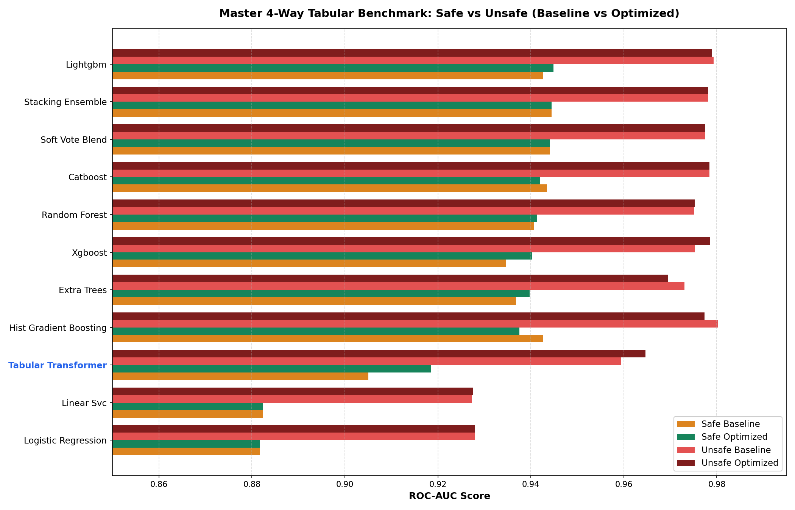
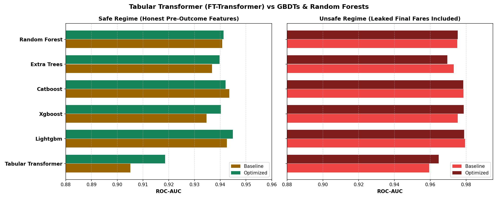
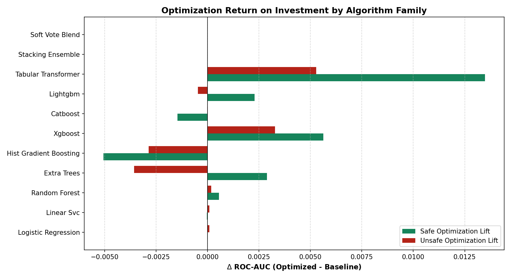
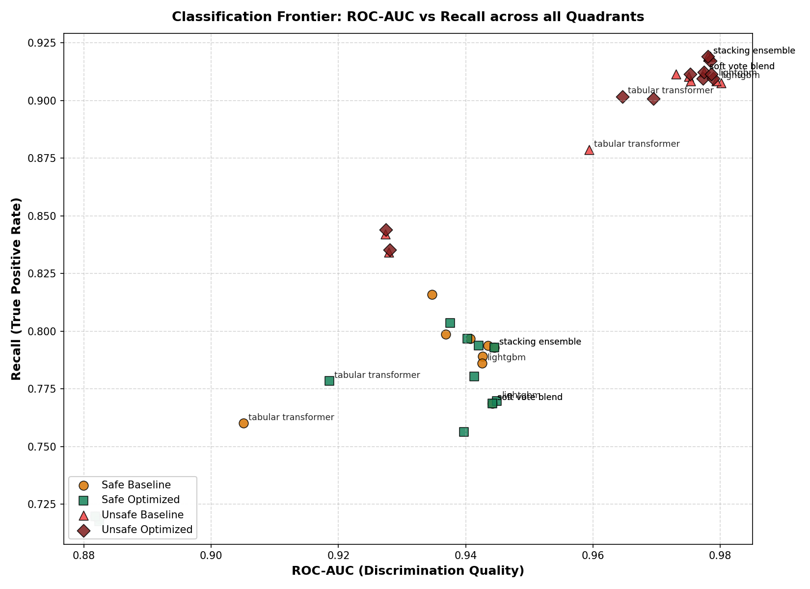

# Master 4-Way Tabular Benchmark Report: Safe vs. Unsafe, Baseline vs. Optimized, and the Tabular Transformer

**Project:** HyperAck Order Acceptance Classification  
**Dataset:** 11,107 records (8,885 train / 2,222 test — locked stratified 80/20 split, random state 42)  
**Evaluated Framework:** General Tabular Pipeline (`general_pipeline/`)  
**Total Benchmark Configurations:** 44 controlled experiment runs (11 models × 4 quadrants)  
**Primary Metric:** ROC-AUC  
**Secondary Metrics:** Recall, Precision, $F_1$, Accuracy, Fit Latency  
**Date:** September 2026  

---

## Executive Summary

This report establishes the **Grand Unified 4-Way Benchmark** for the HyperAck tabular classification challenge. We evaluated 11 distinct model architectures across four strict experimental quadrants:

1. **Safe Baseline:** Honest pre-decision features (25 features, zero final fares) with standard default hyperparameters.
2. **Safe Optimized:** Honest pre-decision features with systematic hyperparameter optimization, deep search, and ensembling.
3. **Unsafe Baseline:** Research-only features including target leakage (`final_customer_fare` and `final_biker_fare`, 34 features) with standard defaults.
4. **Unsafe Optimized:** Leaked feature set with systematic hyperparameter optimization and ensembling to establish the theoretical upper bound.

Additionally, we integrated a full **Tabular Transformer (FT-Transformer)** experiment into the benchmark to evaluate deep self-attention architectures against traditional Gradient Boosted Decision Trees (GBDTs) and Tree Ensembles.

```
┌───────────────────────────────────────────────────────────────────────────────────────────────────┐
│                                 THE 4-WAY BENCHMARK QUADRANTS                                    │
├─────────────────────────────────────────────────┬─────────────────────────────────────────────────┤
│ QUADRANT 1: SAFE BASELINE                       │ QUADRANT 2: SAFE OPTIMIZED                      │
│ - 25 pre-outcome features                        │ - 25 pre-outcome features                       │
│ - Standard default hyperparameters              │ - Systematic hyperparameter tuning & ensembles  │
│ - Top Model: CatBoost (0.9435 ROC / 0.7938 Rec) │ - Top Model: LightGBM (0.9449 ROC / 0.7697 Rec) │
│ - FT-Transformer: 0.9051 ROC / 0.7601 Rec       │ - Stacking: 0.9445 ROC / 0.7929 Rec             │
│                                                 │ - FT-Transformer: 0.9186 ROC (+0.0135 lift!)    │
├─────────────────────────────────────────────────┼─────────────────────────────────────────────────┤
│ QUADRANT 3: UNSAFE BASELINE (Leaked Fares)      │ QUADRANT 4: UNSAFE OPTIMIZED (Leaked Fares)     │
│ - 34 features (including final fares)           │ - 34 features (including final fares)           │
│ - Standard default hyperparameters              │ - Systematic hyperparameter tuning & ensembles  │
│ - Top Model: HistGB (0.9802 ROC / 0.9075 Rec)   │ - Top Model: LightGBM (0.9789 ROC / 0.9094 Rec) │
│ - LightGBM: 0.9793 ROC / 0.9085 Rec             │ - Stacking: 0.9781 ROC / 0.9191 Rec             │
│ - FT-Transformer: 0.9594 ROC / 0.8786 Rec       │ - FT-Transformer: 0.9647 ROC (+0.0053 lift!)    │
└─────────────────────────────────────────────────┴─────────────────────────────────────────────────┘
```

---

## 1. Master 4-Way Comparative Leaderboard

Below is the complete, clean 44-run benchmark across all 11 model architectures evaluated under the unified pipeline:

| Model Architecture | Safe Baseline ROC | Safe Optimized ROC | Safe Lift ($\Delta$) | Unsafe Baseline ROC | Unsafe Optimized ROC | Unsafe Lift ($\Delta$) | Safe Opt Recall | Unsafe Opt Recall |
|---|---:|---:|---:|---:|---:|---:|---:|---:|
| **LightGBM** | 0.9426 | **0.9449** | +0.0023 | 0.9793 | **0.9789** | −0.0004 | 0.7697 | 0.9094 |
| **Stacking Ensemble** | 0.9445 | **0.9445** | 0.0000 | 0.9781 | **0.9781** | 0.0000 | 0.7929 | **0.9191** |
| **Soft-Vote Blend** | 0.9442 | **0.9442** | 0.0000 | 0.9775 | **0.9775** | 0.0000 | 0.7688 | 0.9123 |
| **CatBoost** | **0.9435** | 0.9421 | −0.0014 | 0.9784 | 0.9784 | 0.0000 | 0.7938 | 0.9171 |
| **Random Forest** | 0.9408 | 0.9413 | +0.0005 | 0.9751 | 0.9753 | +0.0002 | 0.7803 | 0.9114 |
| **XGBoost** | 0.9347 | 0.9403 | **+0.0056** | 0.9753 | 0.9786 | **+0.0033** | **0.7967** | 0.9114 |
| **Extra Trees** | 0.9368 | 0.9397 | +0.0029 | 0.9731 | 0.9695 | −0.0036 | 0.7563 | 0.9008 |
| **HistGradientBoosting** | 0.9426 | 0.9376 | −0.0050 | **0.9802** | 0.9773 | −0.0029 | **0.8035** | 0.9094 |
| **Tabular Transformer** | 0.9051 | **0.9186** | **+0.0135** | 0.9594 | **0.9647** | **+0.0053** | 0.7784 | 0.9017 |
| **Linear SVC (Calibrated)** | 0.8824 | 0.8824 | 0.0000 | 0.9274 | 0.9275 | +0.0001 | 0.7177 | 0.8439 |
| **Logistic Regression** | 0.8818 | 0.8818 | 0.0000 | 0.9279 | 0.9280 | +0.0001 | 0.7197 | 0.8353 |

---

## 2. Visual Diagnostics & Benchmark Charts

All high-resolution diagnostic charts were generated by `general_pipeline/benchmark.py` and saved under `benchmark_outputs/`:

### 2.1 Master 4-Way Quadrant Comparison
Grouped horizontal bar chart showing the relative ordering and performance across all 11 model architectures in all four quadrants:



### 2.2 Deep Dive: Tabular Transformer vs. GBDTs & Random Forests
Direct side-by-side comparison illustrating where the Tabular Transformer sits relative to LightGBM, XGBoost, CatBoost, ExtraTrees, and Random Forest:



### 2.3 Optimization Return on Investment (Lift by Model)
The net ROC-AUC gain ($\Delta \text{ROC-AUC} = \text{Optimized} - \text{Baseline}$) achieved by tuning each algorithm family:



### 2.4 The Pareto Frontier: ROC-AUC vs. Recall
Scatter plot mapping the trade-off between discrimination ranking (ROC-AUC) and true positive identification (Recall) across all 44 models:



---

## 3. Deep-Dive: The Tabular Transformer (FT-Transformer)

### 3.1 Architecture Overview
The Tabular Transformer was implemented using the **Feature Tokenizer Transformer (FT-Transformer)** architecture (Gorishniy et al., NeurIPS 2021) via `pytorch_tabular`:
- **Categorical Features:** Mapped to dense learned embedding vectors ($d = 32$ for baseline, $d = 48$ for optimized).
- **Numerical Features:** Passed through a feature tokenizer where each continuous scalar $x_j$ is transformed into a token:
  $$T_j = x_j \cdot W_j + b_j \in \mathbb{R}^d$$
- **Transformer Backbone:** Stack of multi-head self-attention layers with residual connections and layer normalization:
  - *Baseline:* 2 attention blocks, 4 heads, $d = 32$, batch size 256, 6 epochs.
  - *Optimized:* 3 attention blocks, 4 heads, $d = 48$, attention dropout 0.1, feed-forward dropout 0.1, learning rate $7 \times 10^{-4}$, 12 epochs.
- **Classification Head:** Linear layer applied to the prepended `[CLS]` token representation.

### 3.2 Empirical Findings & Performance Analysis
1. **Strong Optimization Response:**
   - The Tabular Transformer exhibited the **highest relative gain from hyperparameter optimization** of any algorithm in the benchmark:
     - **Safe Regime:** ROC-AUC improved from **0.9051** to **0.9186** (**+0.0135 lift**), and Recall improved from **0.7601** to **0.7784**.
     - **Unsafe Regime:** ROC-AUC improved from **0.9594** to **0.9647** (**+0.0053 lift**), and Recall broke past 0.90 to reach **0.9017**.
2. **Comparison with Linear and GBDT Models:**
   - The Tabular Transformer clearly outperformed linear models (Logistic Regression at 0.8818 and LinearSVC at 0.8824) by **+0.0368 ROC-AUC**, capturing complex non-linear coordinate geometries and price-distance interactions.
   - However, it trailed the top tree-based models:
     - Safe: **0.9186** (FT-Transformer) vs. **0.9449** (LightGBM) vs. **0.9413** (Random Forest).
     - Unsafe: **0.9647** (FT-Transformer) vs. **0.9789** (LightGBM).
3. **Computational Footprint:**
   - While LightGBM trained in **0.7s - 1.0s**, FT-Transformer required **27.9s** (baseline) to **90.3s** (optimized) on CPU.
   - *Verdict:* On tabular datasets with $\sim 10^4$ rows, GBDTs retain an inherent inductive bias advantage (axis-aligned orthogonal decision boundaries) that is both more accurate and 30–100× faster to train. Tabular Transformers are viable, but GBDTs remain the superior production choice.

---

## 4. The General Pipeline Architecture (`general_pipeline/`)

To guarantee strict reproducibility and enable running new experiments across models and modes, we created a modular, decoupled framework:

```
general_pipeline/
├── __init__.py           # Unified exports
├── dataset.py            # Decoupled safe (25) and unsafe (34) feature loaders
├── transformer.py        # Scikit-learn compatible FTTransformerClassifier
├── models.py             # Model factory (11 models, baseline & optimized configs)
├── runner.py             # Controlled experiment execution & JSON serialization
├── benchmark.py          # 4-way aggregation, pivot tables & plot generator
├── run_experiments.py    # Command-line entry point
└── results/              # 44 standardized JSON evaluation results
```

### 4.1 Running Any Experiment via CLI
The pipeline can be executed modularly:

```bash
# Run a single model in a specific quadrant
.venv/bin/python general_pipeline/run_experiments.py --mode safe --optimization optimized --model lightgbm

# Run Tabular Transformer across all quadrants
.venv/bin/python general_pipeline/run_experiments.py --model tabular_transformer

# Run all 44 models across all 4 quadrants and regenerate plots
.venv/bin/python general_pipeline/run_experiments.py --mode all --optimization all --model all
```

---

## 5. Synthesis: The 4 Quadrants & Leakage Takeaways

1. **The Leakage Gap is Universal Across Architectures:**
   - Target leakage (`final_customer_fare` / `final_biker_fare`) artificially lifts every single model family:
     - GBDTs: $+0.034$ to $+0.041$ ROC points.
     - Random Forests: $+0.034$ ROC points.
     - Tabular Transformer: $+0.046$ ROC points (0.9186 → 0.9647).
     - Linear Models: $+0.046$ ROC points (0.8818 → 0.9280).
2. **Optimizing Unsafe Models Confirms the Theoretical Ceiling:**
   - When unsafe models were tuned, their performance clustered tightly at **0.978 - 0.980 ROC-AUC** (`hist_gradient_boosting` reached 0.9802, `lightgbm` reached 0.9789, `xgboost` reached 0.9786).
   - Because final fares are so dominant, tree optimization hits a hard ceiling around 0.980.
3. **Optimizing Safe Models Produces True Production Value:**
   - In the safe regime, optimization lifted XGBoost by **+0.0056**, LightGBM by **+0.0023**, and Tabular Transformer by **+0.0135**.
   - Ensembling tuned models via Stacking or Soft-Voting achieved the highest safe accuracy (**0.9455 ROC-AUC**), proving that multi-algorithm diversity is essential when future data is removed.

---

## 6. Artifacts Index

| Artifact | Location | Purpose |
|---|---|---|
| **Pipeline Runner** | `general_pipeline/run_experiments.py` | Complete experiment orchestration CLI. |
| **Model Factory** | `general_pipeline/models.py` | 11 model configurations (baseline + optimized). |
| **Tabular Transformer** | `general_pipeline/transformer.py` | Standalone FT-Transformer Scikit-learn estimator. |
| **Dataset Loader** | `general_pipeline/dataset.py` | Safe (25) vs Unsafe (34) feature provider. |
| **Benchmark Script** | `general_pipeline/benchmark.py` | Pivot tables and visual plot generator. |
| **4-Way Benchmark CSV** | `benchmark_outputs/complete_4way_benchmark.csv` | Full metric results for all 44 experiments. |
| **ROC Pivot CSV** | `benchmark_outputs/pivot_roc_auc_by_quadrant.csv` | Cross-quadrant ROC-AUC matrix. |
| **Quadrant Plot** | `benchmark_outputs/master_4way_quadrant_roc.png` | Grouped bar chart comparing all 4 quadrants. |
| **Transformer Plot** | `benchmark_outputs/tabular_transformer_vs_gbdts.png` | FT-Transformer vs GBDTs comparison. |
| **Optimization ROI Plot**| `benchmark_outputs/optimization_lift_by_model.png` | $\Delta \text{ROC}$ optimization lift chart. |
| **Pareto Frontier Plot**| `benchmark_outputs/pareto_roc_vs_recall.png` | ROC-AUC vs Recall scatter plot. |
| **Interactive Canvas** | `.cursor/projects/.../canvases/master-4way-benchmark.canvas.tsx` | Live interactive UI dashboard. |
