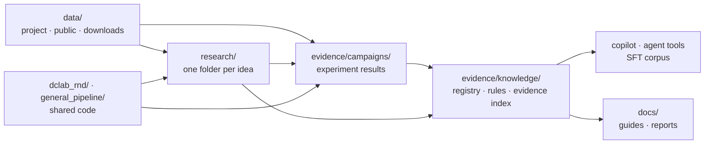

# DCLab Research & Development

The research arm of DCLab. Its job is to find out, with measured evidence, how to build machine-learning models that are *right*, not just high-scoring. Then it turns that evidence into tools DCLab's agent and its users can act on, with proof.

New here? Read the plain-language [field notes](docs/guides/DCLAB_FIELD_NOTES.md) first (no ML background needed), then the [research tracks](research/README.md).

---

## Repository layout

The repository is organized by role. **Data** feeds **research**; research writes **evidence**; shared **code** turns evidence into knowledge and tools; **docs** explain it.



```
.
├── README.md · CLAUDE.md · Makefile          entry points (`make help` lists every command)
│
├── data/                                     ALL datasets
│   ├── project/        hyperack/, telco/     DCLab project data
│   ├── public/         10 UCI datasets       cached parquet (X, y, meta.json)
│   └── downloads/      (gitignored)          public data fetched by the expansion campaign, pinned SHA-256
│
├── research/                                 ONE FOLDER PER IDEA (start here: research/README.md)
│   ├── <idea>/                               every idea has the same shape:
│   │   ├── README.md                         the idea: question, prediction contract, status, conclusions
│   │   ├── INDEX.md                          GENERATED: champion(s), experiments, notebooks, evaluation, reports
│   │   ├── experiments/                      experiment code + results/
│   │   ├── notebooks/  evaluation/  reports/
│   ├── tabular-classification/               HyperAck + 10 public datasets (most mature)
│   ├── churn-prediction/ · tabular-foundation-models/ · llm-fine-tuning/ · agentic-ml-copilot/
│   ├── ml-methodology/ · evaluation-and-trust/ · workflow-model/ · workflow-actions/
│   ├── graph-neural-networks/ · temporal-gnn/ · vision-scene-graphs/ · driving-maps/ · …   planned
│   └── _template/                            template for a new idea (`make new-track`)
│
├── evidence/                                 WHAT WE MEASURED AND WHAT WE LEARNED
│   ├── campaigns/      model_building_50_v1/ · expansion_v1/ · pitfalls_v1/ · agent_verification_v1/
│   └── knowledge/      GENERATED: registry, knowledge base, field guide, rules, rag/records.jsonl
│
├── dclab_rnd/                                SHARED CODE: control plane, campaign engines, evidence index,
│                                             critic gate, copilot/, tools, expansion/, agentic/ (Research Studio)
├── general_pipeline/                         SHARED CODE: tabular modeling pipeline and feature playbook
│
├── docs/               guides/               plain-language guides and product context
├── requirements/       base · ci · agent · agent.lock
├── scripts/            new research track, PDF report
└── tests/              tests for the shared code and the evidence
```

**Rules of thumb:** ideas live in `research/`, and each idea's `INDEX.md` answers "what is the champion, which experiments, notebooks, evaluations and reports belong to it"; anything several ideas share lives at the root. Generated files in `evidence/knowledge/` are rebuilt by `make rd-sync` and `make knowledge`, never edited by hand. Do not rename files inside any `results/` folder, because the evidence registry finds them by path.

---

## Install

```bash
git clone git@github.com:Shahriyar-Moradi/Research_Development_DCLab.git
cd Research_Development_DCLab

# 1) ML environment: experiments, campaigns, copilot, tests (Python 3.10+)
python -m venv .venv
.venv/bin/pip install -r requirements/base.txt pyarrow catboost

# 2) Optional agent environment for the Research Studio (Python 3.12 or 3.13)
uv venv --python 3.13 .venv-agent
uv pip install --python .venv-agent/bin/python -r requirements/agent.lock.txt

# 3) Secrets go in a local .env file (never committed)
#    OPENAI_API_KEY=...     for LLM critic reviews and the Research Studio
#    TABPFN_TOKEN=...       for TabPFN v3 (optional)
```

CI uses only `requirements/ci.txt` (numpy, pandas, scikit-learn, pyarrow). That is enough for the tests, the evidence checks, the copilot, the agent tools and the evidence index.

## Work on your own computer

Everything is in GitHub, so moving from a cloud session to your laptop is a pull:

```bash
git clone git@github.com:Shahriyar-Moradi/Research_Development_DCLab.git   # first time
git checkout main && git pull                                               # afterwards
```

Then install the environments as above and run `make rd-check`. Two things are not in git and must be recreated locally:

- `.env` with your keys (`OPENAI_API_KEY`, optional `TABPFN_TOKEN`).
- `data/downloads/` for the expansion campaign. `make expansion` re-downloads it and checks the pinned hashes.

To keep working with Claude Code locally, run `claude` in the repository folder. [`CLAUDE.md`](CLAUDE.md) gives every new session the repository map, the commands and the rules, so it starts with the same context as this cloud session.

## Check that everything works

```bash
make help        # list every command with a one-line description
make rd-check    # tests + record validation + every "is the generated knowledge current?" check
```

`make rd-check` takes about 10 seconds and should end with every line reporting current or passed.

---

## How to use it

### Review a notebook for methodology mistakes

```bash
python -m dclab_rnd.copilot review path/to/notebook.ipynb                     # report in the terminal
python -m dclab_rnd.copilot review path/to/notebook.ipynb --html review.html  # notes beside each cell
python -m dclab_rnd.copilot review path/to/notebook.ipynb --annotate out.ipynb
python -m dclab_rnd.copilot review path/to/notebook.ipynb --fail-on high      # exit code 1 for CI
```

Each note says what is wrong, how to fix it, and links to the rule and the measured precedent behind it. The original notebook is never modified or executed. Try it on the demo: `make copilot-demo`, then open `docs/copilot_demo.html`. Guide: [Notebook copilot](docs/guides/NOTEBOOK_COPILOT.md).

### Ask the evidence a question

```bash
python -m dclab_rnd.evidence_index search "is call duration safe as a feature" --dataset bank_marketing
python -m dclab_rnd.evidence_index search "oversampling before split" --type pitfall
python -m dclab_rnd.tools call get_record '{"record_id": "LEAK-bank_marketing"}'
```

### Check a new dataset for leakage before modeling

```bash
python -m dclab_rnd.tools call audit_columns '{"path": "data/project/telco/WA_Fn-UseC_-Telco-Customer-Churn.csv", "target": "Churn"}'
```

Flags are review requests. Only the moment each value is created, relative to the prediction, confirms a leak.

### Give an LLM agent the DCLab tools

```bash
python -m dclab_rnd.tools list
python -m dclab_rnd.tools schemas --style openai      # or --style anthropic
pip install mcp && python -m dclab_rnd.tools mcp      # serve them over the Model Context Protocol
```

Guide: [Agent knowledge architecture](docs/guides/AGENT_KNOWLEDGE_ARCHITECTURE.md).

### Run experiments

| Goal | Command |
|---|---|
| Fast safe HyperAck smoke run plus evidence refresh | `make rd-smoke` |
| Any model through the shared pipeline | `.venv/bin/python general_pipeline/run_experiments.py --mode safe --optimization optimized --model lightgbm` |
| 50-experiment workflow campaign (resumable) | `make rd-campaign-plan`, then `.venv/bin/python -m dclab_rnd campaign run --quick` |
| Task-type expansion: fraud, multiclass, time series, text | `make expansion` (downloads public data to `data/downloads/`) |
| Re-measure the six notebook pitfalls | `make pitfalls` |
| Telco churn campaign | `make churn-run` |
| Track-specific experiments | see each track's README under [`research/`](research/README.md) |

After any new result, run `make rd-sync` and `make knowledge` so the registry, evidence index and SFT corpus include it; `make rd-check` fails until you do.

### Use the Research Studio (web UI)

```bash
make agent-serve        # http://127.0.0.1:8765 (agent environment)
make agent-hyperack     # 4 agent-chosen experiments on HyperAck
make agent-churn        # 4 agent-chosen experiments on Telco churn
```

The sidebar has two groups:

| Group | Page | What it shows |
|---|---|---|
| Explore | **Research map** (start page) | Every research idea as a tree (by theme) and a graph (lines join related ideas). Each idea opens one page with the same seven sections: idea · champion · experiments · notebooks · evaluation · reports & research · related ideas. Click any file to read it in place. No API key needed. |
| Explore | Knowledge | The field guide and the critiqued lessons from finished agent runs. |
| Run | Agent research | Start an agent-led run and follow it live (needs `OPENAI_API_KEY`). |
| Run | Recipes & traces | Replayable recipes and exportable trajectories of every run. |

Pages have links you can share: `#map/churn-prediction`, `#run/<id>`, `#knowledge`. The map uses the same data as each `research/<track>/INDEX.md` (`python -m dclab_rnd.research_map --json`), so the two never disagree. Frontend code: `dclab_rnd/agentic/static/` with `css/` (base, layout, one file per view) and `js/` (`core.js`, `app.js` router, `views/*.js`); no third-party scripts, strict CSP.

LangGraph runs the loop and NOOA specialist agents plan and critique. A deterministic worker owns data, training and metrics, so generated code is never executed. Runs are saved under the ignored `agent_runs/` folder.

### Build training data for a small model

```bash
make sft-v3                                                           # rebuild the corpus
python research/llm-fine-tuning/experiments/sft/eval_sft.py score --reference     # sanity check
```

Guide: [SFT data guide](docs/guides/SFT_DATA_GUIDE.md). Training (`train_lora.py`) needs a GPU.

### Start a new research idea

```bash
make new-track NAME=graph-neural-networks TITLE="Graph neural networks" PREFIX=GNN
```

Planned tracks already have a page with the question, field-specific leakage traps, first experiments and datasets; the command adds the working folders and keeps those notes. See [research/README.md](research/README.md).

---

## Headline results

| Finding | Evidence |
|---|---|
| Leakage was the biggest effect: post-outcome columns inflated ROC-AUC by +0.035 (HyperAck), +0.18 (bank marketing) and +0.20 (online shoppers) | [tabular-classification](research/tabular-classification/), `evidence/campaigns/model_building_50_v1` |
| Honest HyperAck champion: ROC-AUC 0.9455 (soft vote ExtraTrees + LightGBM + XGBoost), against 0.9793 with leaked fares | [tabular-classification](research/tabular-classification/) |
| No universal best algorithm: ExtraTrees led 7 of 10 campaign datasets, logistic regression won churn, an ensemble won HyperAck | [Field notes](docs/guides/DCLAB_FIELD_NOTES.md) |
| Raw features were the best recipe on 7 of 10 datasets; 46 engineered features did worse than 25 on HyperAck | `evidence/campaigns/model_building_50_v1` |
| Oversampling before the split inflated ROC-AUC by up to +0.30; scaling before the split by about 0.0001 | [`evidence/campaigns/pitfalls_v1`](evidence/campaigns/pitfalls_v1/PITFALLS_REPORT.md) |
| Random K-fold looked about 1.9× better than time-ordered CV on a forecasting task | [`evidence/campaigns/expansion_v1`](evidence/campaigns/expansion_v1/CAMPAIGN_REPORT.md) |
| 10 of 157 LLM critic objections were disproved by the recorded numbers | `python -m dclab_rnd.critic_gate` |

**Non-negotiable:** never deploy a model that uses information unavailable at the prediction moment (for example `final_customer_fare`, `final_biker_fare`, `duration`).

## Documentation

| Read this | For |
|---|---|
| [Field notes](docs/guides/DCLAB_FIELD_NOTES.md) | Anyone: the lessons in plain language |
| [Research tracks](research/README.md) | Where each idea lives and how to add one |
| [Integration plan](docs/guides/DCLAB_RND_INTEGRATION_PLAN.md) | How the R&D reaches the DCLab product and how the agent is verified |
| [Agent knowledge architecture](docs/guides/AGENT_KNOWLEDGE_ARCHITECTURE.md) | Retrieval vs fine-tuning vs tools |
| [Notebook copilot](docs/guides/NOTEBOOK_COPILOT.md) | What the copilot flags and why |
| [SFT data guide](docs/guides/SFT_DATA_GUIDE.md) | Training data for a small model |
| [Reports](docs/README.md) | Full written reports (Markdown + PDF) and product context |
| [Tabular playbook rule](.cursor/rules/tabular-classification-playbook.mdc) | Standard operating procedure for tabular classification |
