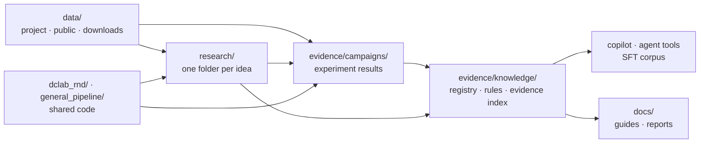

# DCLab Research & Development

The research arm of DCLab. Its job is to find out, with measured evidence, how to build machine-learning models that are *right*, not just high-scoring. Then it turns that evidence into tools DCLab's agent and its users can act on, with proof.

New here? Read the plain-language [field notes](docs/guides/DCLAB_FIELD_NOTES.md) first (no ML background needed), then the [research tracks](research/README.md).

---

## Repository layout

The repository is organized by role. **Data** feeds **research**; research writes **evidence**; shared **code** turns evidence into knowledge and tools; **docs** explain it.



```
.
├── README.md · CLAUDE.md · Makefile          entry points (`make help` lists every command)
│
├── data/                                     ALL datasets
│   ├── project/        hyperack/, telco/     DCLab project data
│   ├── public/         10 UCI datasets       cached parquet (X, y, meta.json)
│   └── downloads/      (gitignored)          public data fetched by the expansion campaign, pinned SHA-256
│
├── research/                                 ONE FOLDER PER IDEA (start here: research/README.md)
│   ├── <idea>/                               every idea has the same shape:
│   │   ├── README.md                         the idea: question, prediction contract, status, conclusions
│   │   ├── INDEX.md                          GENERATED: champion(s), experiments, notebooks, evaluation, reports
│   │   ├── experiments/                      experiment code + results/
│   │   ├── notebooks/  evaluation/  reports/
│   ├── tabular-classification/               HyperAck + 10 public datasets (most mature)
│   ├── churn-prediction/ · tabular-foundation-models/ · llm-fine-tuning/ · agentic-ml-copilot/
│   ├── ml-methodology/ · evaluation-and-trust/ · workflow-model/ · workflow-actions/
│   ├── graph-neural-networks/ · temporal-gnn/ · vision-scene-graphs/ · driving-maps/ · …   planned
│   └── _template/                            template for a new idea (`make new-track`)
│
├── evidence/                                 WHAT WE MEASURED AND WHAT WE LEARNED
│   ├── campaigns/      model_building_50_v1/ · expansion_v1/ · pitfalls_v1/ · agent_verification_v1/
│   └── knowledge/      GENERATED: registry, knowledge base, field guide, rules, rag/records.jsonl
│
├── dclab_rnd/                                SHARED CODE: control plane, campaign engines, evidence index,
│                                             critic gate, copilot/, tools, expansion/, studio/ (the notebook engine),
│                                             agentic/ (API server, web UI, LLM campaigns)
├── general_pipeline/                         SHARED CODE: tabular modeling pipeline and feature playbook
│
├── docs/               guides/               plain-language guides and product context
├── requirements/       base · ci · agent · agent.lock
├── scripts/            new research track, PDF report
└── tests/              tests for the shared code and the evidence
```

**Rules of thumb:** ideas live in `research/`, and each idea's `INDEX.md` answers "what is the champion, which experiments, notebooks, evaluations and reports belong to it"; anything several ideas share lives at the root. Generated files in `evidence/knowledge/` are rebuilt by `make rd-sync` and `make knowledge`, never edited by hand. Do not rename files inside any `results/` folder, because the evidence registry finds them by path.

---

## Install

```bash
git clone git@github.com:Shahriyar-Moradi/Research_Development_DCLab.git
cd Research_Development_DCLab

# 1) ML environment: experiments, campaigns, copilot, tests, the notebook UI (Python 3.10+)
python -m venv .venv
.venv/bin/pip install -r requirements/base.txt pyarrow catboost

# 2) Optional agent environment for the Research Studio (Python 3.12 or 3.13)
uv venv --python 3.13 .venv-agent
uv pip install --python .venv-agent/bin/python -r requirements/agent.lock.txt

# 3) Secrets go in a local .env file (never committed)
#    OPENAI_API_KEY=...     for LLM critic reviews, the intern and Chat UI (an hf_… token works with the Hugging Face router)
#    OPENAI_BASE_URL=...    optional: https://router.huggingface.co/v1, http://127.0.0.1:11434/v1 (Ollama), …
#    TABPFN_TOKEN=...       for TabPFN v3 (optional)
#    OPENID_CLIENT_ID=... / OPENID_CLIENT_SECRET=...   optional: Hugging Face sign-in for Chat UI's ML Intern mode
```

CI uses only `requirements/ci.txt` (numpy, pandas, scikit-learn, pyarrow). That is enough for the tests, the evidence checks, the copilot, the agent tools and the evidence index.

## Work on your own computer

Everything is in GitHub, so moving from a cloud session to your laptop is a pull:

```bash
git clone git@github.com:Shahriyar-Moradi/Research_Development_DCLab.git   # first time
git checkout main && git pull                                               # afterwards
```

Then install the environments as above and run `make rd-check`. Two things are not in git and must be recreated locally:

- `.env` with your keys (`OPENAI_API_KEY`, optional `TABPFN_TOKEN`).
- `data/downloads/` for the expansion campaign. `make expansion` re-downloads it and checks the pinned hashes.

To keep working with Claude Code locally, run `claude` in the repository folder. [`CLAUDE.md`](CLAUDE.md) gives every new session the repository map, the commands and the rules, so it starts with the same context as this cloud session.

## Check that everything works

```bash
make help        # list every command with a one-line description
make rd-check    # tests + record validation + every "is the generated knowledge current?" check
```

`make rd-check` takes about 10 seconds and should end with every line reporting current or passed.

---

## How to use it

### Review a notebook for methodology mistakes

```bash
python -m dclab_rnd.copilot review path/to/notebook.ipynb                     # report in the terminal
python -m dclab_rnd.copilot review path/to/notebook.ipynb --html review.html  # notes beside each cell
python -m dclab_rnd.copilot review path/to/notebook.ipynb --annotate out.ipynb
python -m dclab_rnd.copilot review path/to/notebook.ipynb --fail-on high      # exit code 1 for CI
```

Each note says what is wrong, how to fix it, and links to the rule and the measured precedent behind it. The original notebook is never modified or executed. Try it on the demo: `make copilot-demo`, then open `docs/copilot_demo.html`. Guide: [Notebook copilot](docs/guides/NOTEBOOK_COPILOT.md).

### Ask the evidence a question

```bash
python -m dclab_rnd.evidence_index search "is call duration safe as a feature" --dataset bank_marketing
python -m dclab_rnd.evidence_index search "oversampling before split" --type pitfall
python -m dclab_rnd.tools call get_record '{"record_id": "LEAK-bank_marketing"}'
```

### Check a new dataset for leakage before modeling

```bash
python -m dclab_rnd.tools call audit_columns '{"path": "data/project/telco/WA_Fn-UseC_-Telco-Customer-Churn.csv", "target": "Churn"}'
```

Flags are review requests. Only the moment each value is created, relative to the prediction, confirms a leak.

### Give an LLM agent the DCLab tools

```bash
python -m dclab_rnd.tools list
python -m dclab_rnd.tools schemas --style openai      # or --style anthropic
pip install mcp && python -m dclab_rnd.tools mcp      # serve them over the Model Context Protocol
```

Guide: [Agent knowledge architecture](docs/guides/AGENT_KNOWLEDGE_ARCHITECTURE.md).

### Run experiments

| Goal | Command |
|---|---|
| Fast safe HyperAck smoke run plus evidence refresh | `make rd-smoke` |
| Any model through the shared pipeline | `.venv/bin/python general_pipeline/run_experiments.py --mode safe --optimization optimized --model lightgbm` |
| 50-experiment workflow campaign (resumable) | `make rd-campaign-plan`, then `.venv/bin/python -m dclab_rnd campaign run --quick` |
| Task-type expansion: fraud, multiclass, time series, text | `make expansion` (downloads public data to `data/downloads/`) |
| Re-measure the six notebook pitfalls | `make pitfalls` |
| Telco churn campaign | `make churn-run` |
| Track-specific experiments | see each track's README under [`research/`](research/README.md) |

After any new result, run `make rd-sync` and `make knowledge` so the registry, evidence index and SFT corpus include it; `make rd-check` fails until you do.

### Use the DCLab notebook (web UI)

```bash
make notebook           # http://127.0.0.1:8765 in the ML environment (no LLM needed)
make agent-serve        # the same UI in the agent environment, with the LLM campaigns enabled
```

The notebook is the product side of this repository (the **Intern** page drives it from a chat; see below): a data scientist brings a table and builds a model **stage by stage, with evidence, instead of writing the pipeline**. Cells are stages, not code.

| Step | What happens | Who decides |
|---|---|---|
| 0 · Data | Upload a CSV/TSV/Parquet, or start from one of 16 datasets the R&D already studied: 10 UCI tables, HyperAck, Telco, and the four Kaggle/GitHub sets of the expansion campaign (imbalanced fraud, 26-class letters, daily bike demand, clothing reviews with text) | you |
| 1 · Prediction contract | Target, task, *the moment you predict*, forbidden columns, identifiers, time/group columns, metric. The agent audits the columns and proposes what to forbid, with proof | you, from the agent's proposal |
| 2 · Understand the data | The holdout is locked first; training rows are profiled (missingness, identifiers, drift) | code |
| 3 · Audit leakage | Heuristic review candidates, a detector self-test, and the measured safe-vs-unsafe score gap of the forbidden columns | code; you confirm or forbid columns |
| 4 · Feature ladder | Recipes on identical folds; the smallest within tolerance wins | code; you can override |
| 5 · Algorithm screen | Five model families, ranked with fold spread counted | code; you can override |
| 6 · Tune and confirm | Explicit parameter candidates, then the holdout scored **once** (95% bootstrap interval) | code |
| 7 · Report and notebook | A `.ipynb` that reproduces the approved workflow in plain scikit-learn, and a `.md` report with every decision and its proof | export |

Every stage writes a record in the same shape as a campaign result, and every agent note names the rule it applies and the measured precedent behind it ("show proof" opens the record). Supported today: binary and multiclass classification and regression on tabular data (free-text columns for binary targets), with time-ordered, grouped or stratified splits. With `OPENAI_API_KEY` set and the `openai` package installed, an LLM adds an advisory critique per stage; without it, the agent is fully deterministic.

Other pages: **Research map** (every research idea as a tree and a graph, with its champion, experiments, notebooks, evaluation and reports), **Knowledge** (the field guide and lessons from campaigns) and **Agent campaigns** (the LangGraph + NOOA research loop on curated datasets; needs the agent environment and `OPENAI_API_KEY`). Links are shareable: `#project/<id>`, `#map/churn-prediction`, `#run/<id>`.

**The workflow graph.** Each project walks ten steps (WF-01 contract … WF-10 knowledge capture). Before any move runs, from you, the intern or the API, deterministic code in `dclab_rnd/studio/graph.py` checks it and returns *allowed*, *blocked* or *needs a person*, with the failed checks, the DCLab rules and the evidence behind the answer. The rules that always hold: no skipping a step, only a person approves a gate, the agent never reuses the holdout or changes an earlier choice after the holdout was used, and a person who reruns the final stage writes a reason (kept in the evidence). Two optional gates, set per project in the **Graph** tab: sign the contract before the data stage, and approve before the intern opens the holdout. Every verdict and its outcome is appended to the project's `transitions.jsonl`: the audit trail, and the trajectory data the policy model will learn from. API: `GET /api/projects/<id>/graph`, `POST …/graph/check`, `POST …/approvals`.

Code: `dclab_rnd/studio/` (projects, data, contract, engine, workflow graph, agent notes, export), API in `dclab_rnd/agentic/server.py`, UI in `dclab_rnd/agentic/static/` (`css/`, `js/views/*.js`; no third-party scripts, strict CSP). Projects live under the ignored `agent_runs/projects/`.

### Use the intern (chat mode with tools and a budget)

Like Hugging Face's [ML Intern](https://huggingface.co/docs/chat-ui/ml-intern/getting-started), the **Intern** page is a conversation that plans and runs ML work with tools under a compute budget. The differences are deliberate: it runs on this machine, its compute is the DCLab notebook engine, and every tool it can call is one the R&D already verified (evidence search, the column auditor, the prediction contract, the five stages, the notebook export). The model proposes and explains; deterministic code owns every split, metric and selection rule.

```bash
make notebook                       # then open http://127.0.0.1:8765/#intern
```

Describe the task ("Build a leakage-safe churn model on the Telco sample and tell me the honest score"), pick a budget (tool calls and minutes), and watch the plan, the tool calls and the report. The project it builds opens in the notebook; from any project, **Hand to the intern** continues it.

| Setting (in `.env` or the environment) | Meaning |
|---|---|
| `OPENAI_API_KEY` | The key the model is called with. Never typed into the UI. |
| `OPENAI_BASE_URL` | Any OpenAI-compatible endpoint. Hugging Face router: `https://router.huggingface.co/v1` with an `hf_…` key. Ollama: `http://127.0.0.1:11434/v1`. Default: OpenAI. |
| `DCLAB_INTERN_MODEL` (or `OPENAI_MODEL`) | The model id, e.g. `gpt-5.6-terra`, `zai-org/GLM-5.3-Flash` on the router, `qwen2.5:7b` on Ollama. |
| `DCLAB_INTERN_HOME` | Where sessions are kept (default `agent_runs/intern/`). |

Without a key the intern still works: it follows the **standard plan** (pick the dataset the task names → create the project → write the contract from the R&D audit and suggestion → run the five stages → report), so the product is usable offline and every transcript has the same shape. Budgets are enforced on every tool call; new projects start in quick mode (3,000 rows).

Where the code lives: `dclab_rnd/intern/` (`tools.py` the toolbox, `llm.py` the client, `loop.py` the budgeted loop and the standard plan, `sessions.py` storage), routes under `/api/intern` in `dclab_rnd/agentic/server.py`, UI in `static/js/views/intern.js`. Tests: `tests/test_intern.py` (a scripted model replays tool calls, so no key is needed).

### Use Hugging Face Chat UI and ML Intern with DCLab

The same tools are also an **MCP server**: the notebook serves them at `http://127.0.0.1:8765/mcp` (or standalone with `make mcp-serve`). That lets Hugging Face's own [Chat UI](https://github.com/huggingface/chat-ui), the app behind HuggingChat and its ML Intern mode, drive DCLab. In a Chat UI conversation the model sees all 18 DCLab tools next to its own, so "build a leakage-safe churn model on the Telco sample" creates a real project here, writes the contract, runs the five stages and exports the notebook.

```bash
make notebook            # terminal 1: DCLab (also serves /mcp)
make chat-ui             # terminal 2: clones Chat UI into .chat-ui/, writes its .env.local, runs it → http://localhost:5173/
make chat-ui-intern      # or the same with ML Intern mode compiled in → http://localhost:5173/?mode=ml-intern
```

`scripts/chat_ui.py` writes Chat UI's `.env.local` from this repository's `.env`, so keys live in one place:

| From `.env` | Becomes in Chat UI |
|---|---|
| `OPENAI_API_KEY`, `OPENAI_BASE_URL` (default the Hugging Face router) | the model endpoint |
| always | `MCP_SERVERS=[{"name": "DCLab notebook", "url": "http://127.0.0.1:8765/mcp"}]` |
| `--ml-intern` | `ML_ASSISTANT_MODE=true` and `ML_ASSISTANT_MODELS` (default GLM-5.3-Flash and Kimi-K3; override with `DCLAB_CHAT_UI_MODELS`) |
| `OPENID_CLIENT_ID`, `OPENID_CLIENT_SECRET` | Hugging Face sign-in, `MCP_FORWARD_HF_USER_TOKEN=true` |

Needs Node.js 20+. For ML Intern's Hub Jobs and sandboxes, create the OAuth app described in [Chat UI's guide](https://github.com/huggingface/chat-ui/blob/main/docs/source/ml-intern/local-development.md) (redirect `http://localhost:5173/login/callback`; scopes `openid profile inference-api read-mcp read-billing jobs`), sign in, and set a compute budget in the status bar: Hub Jobs bill your Hugging Face credits. The DCLab tools themselves run on your machine and cost nothing.

Verified end to end with the real Chat UI: in plain mode the model was offered the 18 DCLab tools; in ML Intern mode 32 tools (DCLab's 18 plus ML Intern's planning, research, sandbox, Trackio and file tools); it called `list_samples` over MCP and answered from DCLab's reply. The Hub's own Jobs tools join after you sign in. Note that the ML Intern GitHub repository is archived; the mode now lives inside Chat UI, which is what this uses.

### The notebook as a data factory

Every finished project is also training data. `GET /api/projects/<id>/export/sft` (the **Training examples** button in the report cell) and `python -m dclab_rnd.studio.sft --out projects.chat.jsonl` turn each completed stage into a RAFT-style example in the SFT v3 shape (dataset card + stage card + what the run did → a five-part answer that cites the record IDs behind it). Nothing is invented: every sentence comes from the stage record. Keep these in a separate file from the campaign corpus and review them before training, as [the SFT guide](docs/guides/SFT_DATA_GUIDE.md) describes.

### Build training data for a small model

```bash
make sft-v3                                                           # rebuild the corpus
python research/llm-fine-tuning/experiments/sft/eval_sft.py score --reference     # sanity check
```

Guide: [SFT data guide](docs/guides/SFT_DATA_GUIDE.md). Training (`train_lora.py`) needs a GPU.

### Start a new research idea

```bash
make new-track NAME=graph-neural-networks TITLE="Graph neural networks" PREFIX=GNN
```

Planned tracks already have a page with the question, field-specific leakage traps, first experiments and datasets; the command adds the working folders and keeps those notes. See [research/README.md](research/README.md).

---

## Headline results

| Finding | Evidence |
|---|---|
| Leakage was the biggest effect: post-outcome columns inflated ROC-AUC by +0.035 (HyperAck), +0.18 (bank marketing) and +0.20 (online shoppers) | [tabular-classification](research/tabular-classification/), `evidence/campaigns/model_building_50_v1` |
| Honest HyperAck champion: ROC-AUC 0.9455 (soft vote ExtraTrees + LightGBM + XGBoost), against 0.9793 with leaked fares | [tabular-classification](research/tabular-classification/) |
| No universal best algorithm: ExtraTrees led 7 of 10 campaign datasets, logistic regression won churn, an ensemble won HyperAck | [Field notes](docs/guides/DCLAB_FIELD_NOTES.md) |
| Raw features were the best recipe on 7 of 10 datasets; 46 engineered features did worse than 25 on HyperAck | `evidence/campaigns/model_building_50_v1` |
| Oversampling before the split inflated ROC-AUC by up to +0.30; scaling before the split by about 0.0001 | [`evidence/campaigns/pitfalls_v1`](evidence/campaigns/pitfalls_v1/PITFALLS_REPORT.md) |
| Random K-fold looked about 1.9× better than time-ordered CV on a forecasting task | [`evidence/campaigns/expansion_v1`](evidence/campaigns/expansion_v1/CAMPAIGN_REPORT.md) |
| 10 of 157 LLM critic objections were disproved by the recorded numbers | `python -m dclab_rnd.critic_gate` |

**Non-negotiable:** never deploy a model that uses information unavailable at the prediction moment (for example `final_customer_fare`, `final_biker_fare`, `duration`).

## Documentation

| Read this | For |
|---|---|
| [Field notes](docs/guides/DCLAB_FIELD_NOTES.md) | Anyone: the lessons in plain language |
| [Research tracks](research/README.md) | Where each idea lives and how to add one |
| [Integration plan](docs/guides/DCLAB_RND_INTEGRATION_PLAN.md) | How the R&D reaches the DCLab product and how the agent is verified |
| [Agent knowledge architecture](docs/guides/AGENT_KNOWLEDGE_ARCHITECTURE.md) | Retrieval vs fine-tuning vs tools |
| [Notebook copilot](docs/guides/NOTEBOOK_COPILOT.md) | What the copilot flags and why |
| [SFT data guide](docs/guides/SFT_DATA_GUIDE.md) | Training data for a small model |
| [Reports](docs/README.md) | Full written reports (Markdown + PDF) and product context |
| [Tabular playbook rule](.cursor/rules/tabular-classification-playbook.mdc) | Standard operating procedure for tabular classification |
