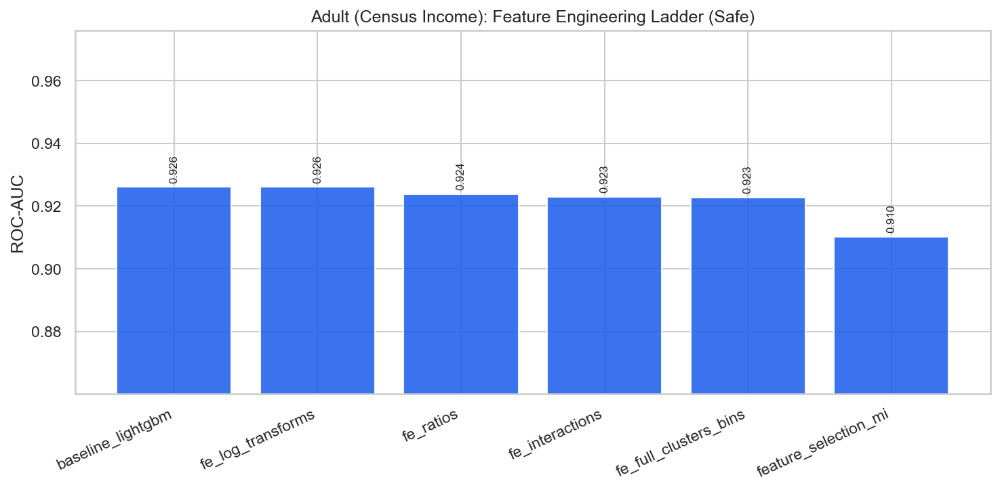

# Adult (Census Income) — Feature Engineering & Selection Report

**Project:** `external_projects/adult_exp/`  
**Source:** [https://archive.ics.uci.edu/dataset/2/adult](https://archive.ics.uci.edu/dataset/2/adult)  
**Rows / features (raw):** 48842 / 14  
**Positive rate:** 0.239  
**Protocol:** stratified 80/20, seed 42; all stateful FE fit on **train only**

---

## 1. Problem & decision-time policy

Predict income >$50K from census demographics (mixed categorical/numeric).

### Leakage / safe vs unsafe
- **Has classic leakage columns:** False
- **Unsafe-only features:** `[]`
- **Rationale:** Census attributes are contemporaneous. No post-outcome leakage columns; safe and unsafe feature matrices are identical. Focus is FE + optimization ladder.

When leakage exists, **safe** drops post-outcome columns (HyperAck analog of final fares).  
When it does not, safe and unsafe matrices are identical — the ladder still documents FE and optimization lifts.

---

## 2. Feature engineering ladder (what we tried)

| Stage | Idea | Why (HyperAck playbook) |
|---|---|---|
| raw | Original numeric matrix | Floor score |
| logs | `log1p` on skewed non-negative cols | Tame heavy tails |
| ratios | Pairwise intensity ratios | Scale-normalized signals |
| interactions | Products of top-MI features | Non-linear combinations |
| full_fe | + KMeans clusters + quantile bins | Spatial/soft thresholds (train-fit) |
| selected | Top mutual-information subset | Test dilution vs compact set |

---

## 3. Safe-mode experiment results

| ID | Experiment | FE stage | #Feats | ROC-AUC | Recall | F1 | Optimization |
|---|---|---|---:|---:|---:|---:|---|
| 01 | baseline_logistic | raw | 14 | 0.8502 | 0.4399 | 0.5460 | none |
| 02 | baseline_lightgbm | raw | 14 | 0.9261 | 0.6552 | 0.7073 | none |
| 03 | fe_log_transforms | logs | 22 | 0.9261 | 0.6552 | 0.7073 | none |
| 04 | fe_ratios | ratios | 37 | 0.9238 | 0.6426 | 0.7001 | none |
| 05 | fe_interactions | interactions | 45 | 0.9230 | 0.6437 | 0.7004 | none |
| 06 | fe_full_clusters_bins | full_fe | 50 | 0.9228 | 0.6499 | 0.7040 | none |
| 07 | feature_selection_mi | selected | 25 | 0.9101 | 0.6123 | 0.6709 | mutual_info_selection |
| 08 | tuned_xgboost | full_fe | 50 | 0.9255 | 0.6437 | 0.7085 | RandomizedSearchCV_roc_auc |
| 09 | tuned_lightgbm | full_fe | 50 | 0.9251 | 0.6468 | 0.7058 | RandomizedSearchCV_roc_auc |
| 10 | hist_gradient_boosting | full_fe | 50 | 0.9217 | 0.6426 | 0.7009 | none |
| 11 | extra_trees_strong | full_fe | 50 | 0.9012 | 0.5350 | 0.6329 | hand_tuned |
| 12 | calibrated_lgbm_threshold | full_fe | 50 | 0.9235 | 0.6405 | 0.6998 | isotonic_calibration |
| 13 | stacking_ensemble | full_fe | 50 | 0.9223 | 0.6437 | 0.7040 | oof_stacking |
| 14 | soft_vote_blend | full_fe | 50 | 0.9197 | 0.5998 | 0.6858 | soft_probability_blend |
| 15 | leakage_honesty_check | full_fe | 50 | 0.9240 | 0.6416 | 0.7041 | none |

**Best safe model:** `baseline_lightgbm` — ROC-AUC **0.9261**, F1 **0.7073**  
**Best optimization method (safe):** `RandomizedSearchCV_roc_auc` via `tuned_xgboost` (AUC 0.9255)

### FE stage chart

---

## 4. Feature selection findings

Experiment `07 feature_selection_mi` keeps a top-MI subset of the full FE matrix.  
Compare its ROC-AUC against `06 fe_full_clusters_bins`:

- Full FE AUC: **0.9228** (50 feats)
- Selected AUC: **0.9101** (25 feats)
- Δ: **-0.0126** — full FE retained more signal (dilution not an issue / selection too aggressive).

---

## 5. Figures
- `benchmark_outputs/fe_ladder_safe.png`
- `benchmark_outputs/safe_vs_unsafe_by_experiment.png`
- `benchmark_outputs/ladder_results.csv`
