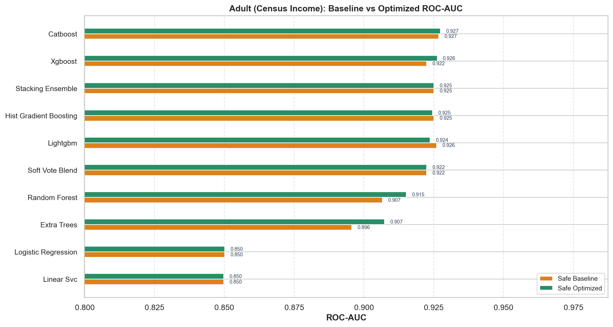
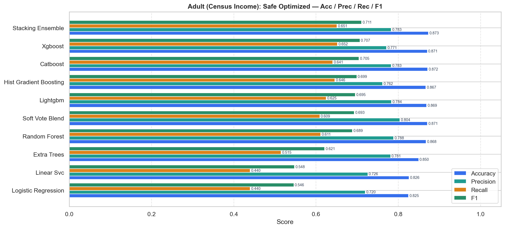
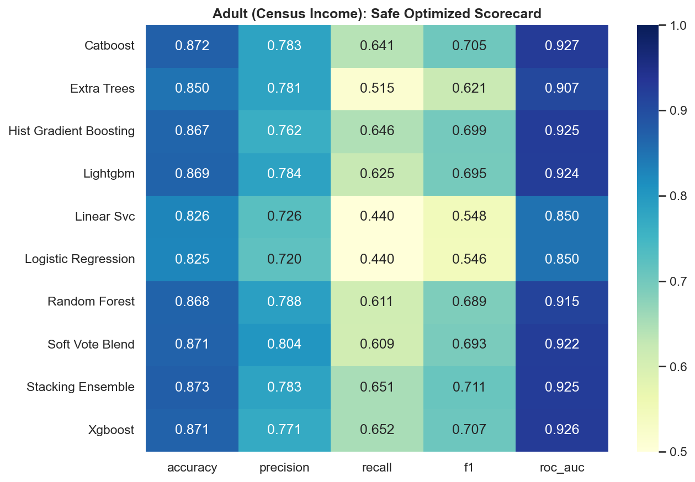
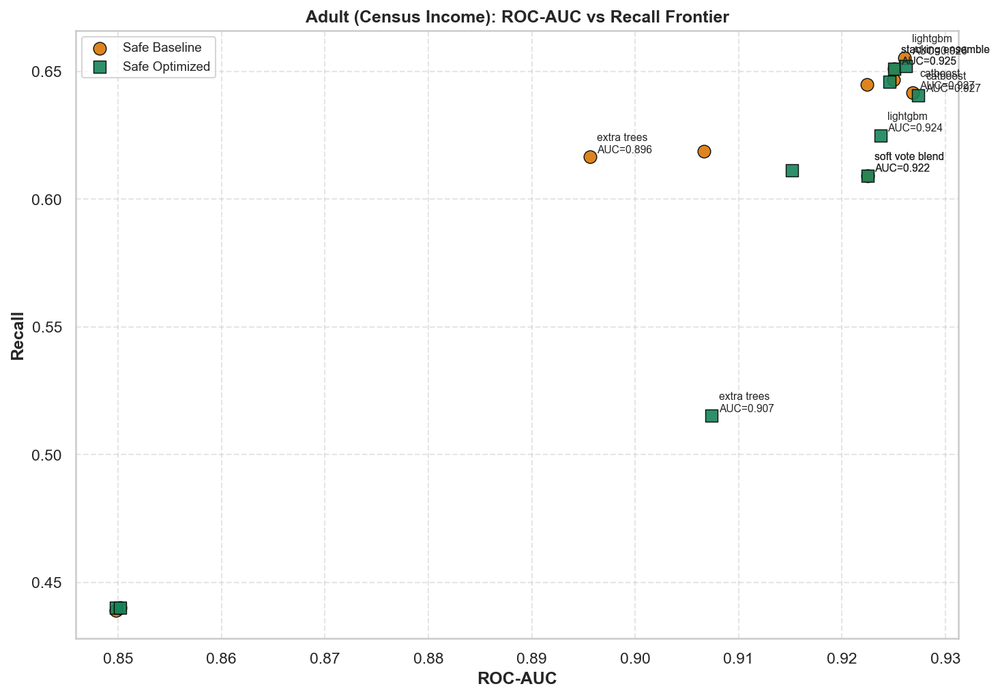
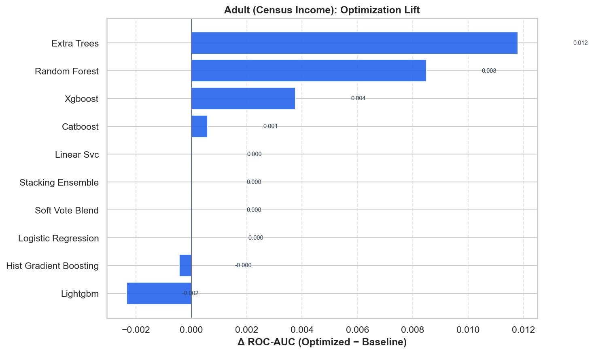

# Adult (Census Income) — Master Benchmark Report

HyperAck-style project folder: `external_projects/adult_exp/`

- **Source:** [https://archive.ics.uci.edu/dataset/2/adult](https://archive.ics.uci.edu/dataset/2/adult)
- **Description:** Predict income >$50K from census demographics (mixed categorical/numeric).
- **Split:** stratified 80/20, seed 42
- **Champion (safe optimized):** `catboost` — ROC-AUC **0.9274**, F1 **0.7046**
- **Overall best:** `catboost` (safe/optimized) — ROC-AUC **0.9274**

## Full results

| Mode | Opt | Model | ROC-AUC | Acc | Prec | Rec | F1 |
|---|---|---|---:|---:|---:|---:|---:|
| safe | baseline | catboost | 0.9268 | 0.8708 | 0.7792 | 0.6416 | 0.7037 |
| safe | baseline | lightgbm | 0.9261 | 0.8702 | 0.7684 | 0.6552 | 0.7073 |
| safe | baseline | stacking_ensemble | 0.9250 | 0.8732 | 0.7827 | 0.6510 | 0.7108 |
| safe | baseline | hist_gradient_boosting | 0.9250 | 0.8690 | 0.7689 | 0.6468 | 0.7026 |
| safe | baseline | soft_vote_blend | 0.9225 | 0.8710 | 0.8041 | 0.6092 | 0.6932 |
| safe | baseline | xgboost | 0.9224 | 0.8672 | 0.7636 | 0.6447 | 0.6992 |
| safe | baseline | random_forest | 0.9067 | 0.8555 | 0.7354 | 0.6186 | 0.6720 |
| safe | baseline | extra_trees | 0.8956 | 0.8488 | 0.7126 | 0.6165 | 0.6611 |
| safe | baseline | logistic_regression | 0.8502 | 0.8250 | 0.7197 | 0.4399 | 0.5460 |
| safe | baseline | linear_svc | 0.8498 | 0.8260 | 0.7254 | 0.4389 | 0.5469 |
| safe | optimized | catboost | 0.9274 | 0.8715 | 0.7829 | 0.6405 | 0.7046 |
| safe | optimized | xgboost | 0.9262 | 0.8705 | 0.7713 | 0.6520 | 0.7067 |
| safe | optimized | stacking_ensemble | 0.9250 | 0.8732 | 0.7827 | 0.6510 | 0.7108 |
| safe | optimized | hist_gradient_boosting | 0.9246 | 0.8670 | 0.7620 | 0.6458 | 0.6991 |
| safe | optimized | lightgbm | 0.9237 | 0.8690 | 0.7837 | 0.6249 | 0.6953 |
| safe | optimized | soft_vote_blend | 0.9225 | 0.8710 | 0.8041 | 0.6092 | 0.6932 |
| safe | optimized | random_forest | 0.9152 | 0.8678 | 0.7884 | 0.6113 | 0.6886 |
| safe | optimized | extra_trees | 0.9074 | 0.8495 | 0.7813 | 0.5152 | 0.6209 |
| safe | optimized | logistic_regression | 0.8502 | 0.8250 | 0.7197 | 0.4399 | 0.5460 |
| safe | optimized | linear_svc | 0.8498 | 0.8263 | 0.7259 | 0.4399 | 0.5478 |

## Figures











## Reproduce

```bash
.venv/bin/python external_projects/adult_exp/run_all.py
```
