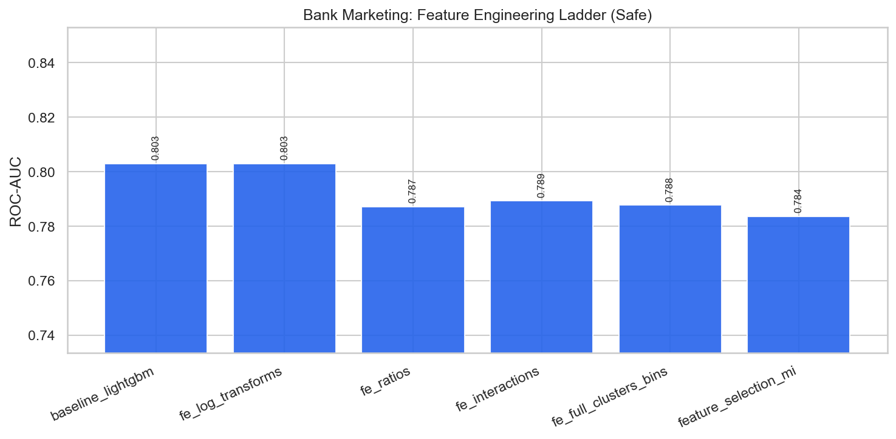

# Bank Marketing — Complete Master Report

HyperAck-style end-to-end study for **Bank Marketing**.

## Executive summary

| Item | Value |
|---|---|
| Best safe ROC-AUC | **0.8029** (`baseline_lightgbm`) |
| Best unsafe ROC-AUC | **0.9357** (`tuned_xgboost`) |
| Best optimization method | `soft_probability_blend` |
| Leakage present | True |
| Leakage columns | `['duration']` |

```
Unsafe ceiling (if leakage)  ──▶  0.9357
        │ drop leakage
        ▼
Safe baseline / FE ladder    ──▶  see FEATURE_ENGINEERING_REPORT.md
        │ RandomizedSearch / ensembles
        ▼
Safe optimized champion      ──▶  0.8029  (baseline_lightgbm)
```

## Detailed documents

1. [FEATURE_ENGINEERING_REPORT.md](FEATURE_ENGINEERING_REPORT.md) — FE stages, selection, safe results  
2. [OPTIMIZATION_REPORT.md](OPTIMIZATION_REPORT.md) — tuning/ensembling methods & which won  
3. [MASTER_BENCHMARK_REPORT.md](MASTER_BENCHMARK_REPORT.md) — model-zoo benchmark  
4. Notebooks in `notebooks/` — step-by-step reproducible narrative  

## Key figures





## Reproduce

```bash
.venv/bin/python general_pipeline/playbook/run_playbook.py --dataset bank_marketing
.venv/bin/python external_projects/bank_marketing_exp/run_all.py
```

## Future datasets

Use the same playbook pipeline:

```bash
# 1) add dataset to external_catalog + download
# 2) define leakage in playbook/policy.py
# 3) run:
.venv/bin/python general_pipeline/playbook/run_playbook.py --dataset <new_key>
```
