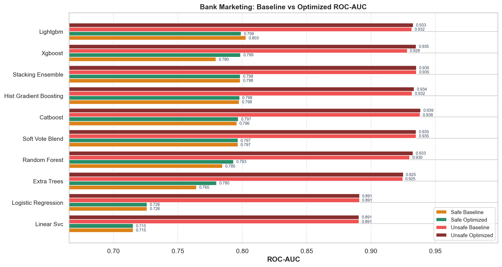
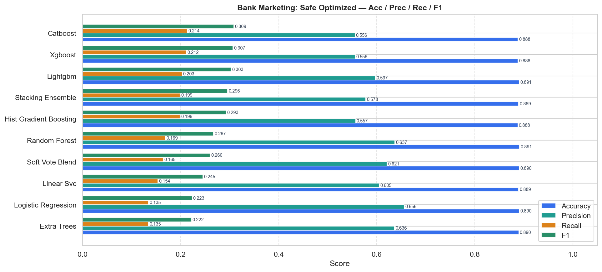
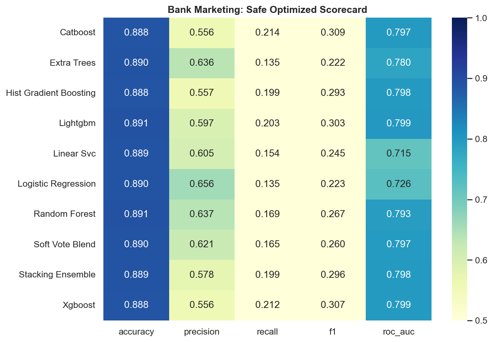
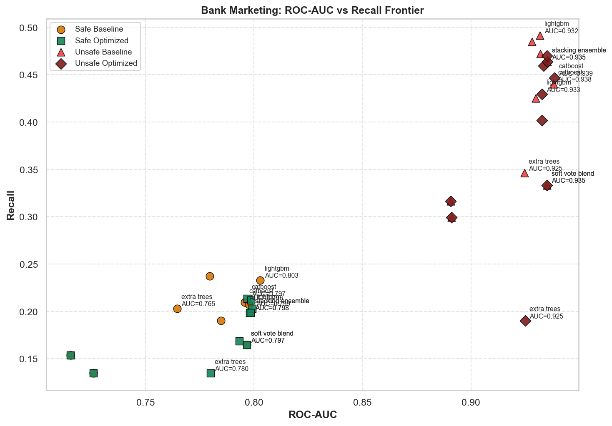
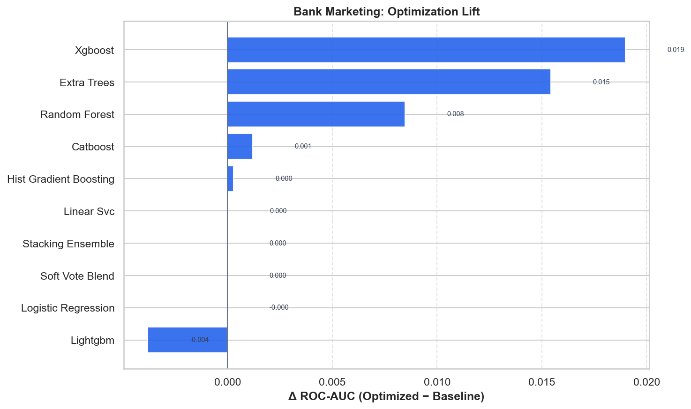

# Bank Marketing — Master Benchmark Report

HyperAck-style project folder: `external_projects/bank_marketing_exp/`

- **Source:** [https://archive.ics.uci.edu/dataset/222/bank+marketing](https://archive.ics.uci.edu/dataset/222/bank+marketing)
- **Description:** Predict term-deposit subscription from phone marketing campaign data.
- **Split:** stratified 80/20, seed 42
- **Champion (safe optimized):** `lightgbm` — ROC-AUC **0.7991**, F1 **0.3030**
- **Overall best:** `catboost` (unsafe/optimized) — ROC-AUC **0.9386**

## Leakage protocol
Safe mode drops `['duration']` (post-outcome). Unsafe mode keeps all features — analogous to HyperAck final fares.

## Full results

| Mode | Opt | Model | ROC-AUC | Acc | Prec | Rec | F1 |
|---|---|---|---:|---:|---:|---:|---:|
| safe | baseline | lightgbm | 0.8029 | 0.8910 | 0.5860 | 0.2329 | 0.3333 |
| safe | baseline | stacking_ensemble | 0.7984 | 0.8892 | 0.5776 | 0.1987 | 0.2957 |
| safe | baseline | hist_gradient_boosting | 0.7977 | 0.8905 | 0.5915 | 0.2073 | 0.3070 |
| safe | baseline | soft_vote_blend | 0.7966 | 0.8905 | 0.6210 | 0.1645 | 0.2601 |
| safe | baseline | catboost | 0.7957 | 0.8890 | 0.5698 | 0.2094 | 0.3063 |
| safe | baseline | random_forest | 0.7847 | 0.8882 | 0.5669 | 0.1902 | 0.2848 |
| safe | baseline | xgboost | 0.7797 | 0.8852 | 0.5211 | 0.2372 | 0.3260 |
| safe | baseline | extra_trees | 0.7645 | 0.8850 | 0.5220 | 0.2030 | 0.2923 |
| safe | baseline | logistic_regression | 0.7260 | 0.8905 | 0.6562 | 0.1346 | 0.2234 |
| safe | baseline | linear_svc | 0.7154 | 0.8892 | 0.6050 | 0.1538 | 0.2453 |
| safe | optimized | lightgbm | 0.7991 | 0.8908 | 0.5975 | 0.2030 | 0.3030 |
| safe | optimized | xgboost | 0.7986 | 0.8880 | 0.5562 | 0.2115 | 0.3065 |
| safe | optimized | stacking_ensemble | 0.7984 | 0.8892 | 0.5776 | 0.1987 | 0.2957 |
| safe | optimized | hist_gradient_boosting | 0.7979 | 0.8878 | 0.5569 | 0.1987 | 0.2929 |
| safe | optimized | catboost | 0.7969 | 0.8880 | 0.5556 | 0.2137 | 0.3086 |
| safe | optimized | soft_vote_blend | 0.7966 | 0.8905 | 0.6210 | 0.1645 | 0.2601 |
| safe | optimized | random_forest | 0.7931 | 0.8915 | 0.6371 | 0.1688 | 0.2669 |
| safe | optimized | extra_trees | 0.7800 | 0.8898 | 0.6364 | 0.1346 | 0.2222 |
| safe | optimized | logistic_regression | 0.7260 | 0.8905 | 0.6562 | 0.1346 | 0.2234 |
| safe | optimized | linear_svc | 0.7154 | 0.8892 | 0.6050 | 0.1538 | 0.2453 |
| unsafe | baseline | catboost | 0.9381 | 0.9090 | 0.6688 | 0.4402 | 0.5309 |
| unsafe | baseline | stacking_ensemble | 0.9353 | 0.9100 | 0.6656 | 0.4637 | 0.5466 |
| unsafe | baseline | soft_vote_blend | 0.9351 | 0.9052 | 0.6996 | 0.3333 | 0.4515 |
| unsafe | baseline | hist_gradient_boosting | 0.9319 | 0.9080 | 0.6462 | 0.4722 | 0.5457 |
| unsafe | baseline | lightgbm | 0.9318 | 0.9083 | 0.6407 | 0.4915 | 0.5562 |
| unsafe | baseline | random_forest | 0.9299 | 0.9077 | 0.6656 | 0.4252 | 0.5189 |
| unsafe | baseline | xgboost | 0.9281 | 0.9062 | 0.6288 | 0.4850 | 0.5476 |
| unsafe | baseline | extra_trees | 0.9246 | 0.9038 | 0.6722 | 0.3462 | 0.4570 |
| unsafe | baseline | logistic_regression | 0.8910 | 0.9000 | 0.6604 | 0.2991 | 0.4118 |
| unsafe | baseline | linear_svc | 0.8906 | 0.9005 | 0.6549 | 0.3162 | 0.4265 |
| unsafe | optimized | catboost | 0.9386 | 0.9090 | 0.6656 | 0.4466 | 0.5345 |
| unsafe | optimized | stacking_ensemble | 0.9353 | 0.9100 | 0.6656 | 0.4637 | 0.5466 |
| unsafe | optimized | soft_vote_blend | 0.9351 | 0.9052 | 0.6996 | 0.3333 | 0.4515 |
| unsafe | optimized | xgboost | 0.9350 | 0.9075 | 0.6433 | 0.4701 | 0.5432 |
| unsafe | optimized | hist_gradient_boosting | 0.9336 | 0.9048 | 0.6268 | 0.4594 | 0.5302 |
| unsafe | optimized | lightgbm | 0.9328 | 0.9073 | 0.6590 | 0.4295 | 0.5201 |
| unsafe | optimized | random_forest | 0.9327 | 0.9090 | 0.6912 | 0.4017 | 0.5081 |
| unsafe | optimized | extra_trees | 0.9250 | 0.8968 | 0.7236 | 0.1902 | 0.3012 |
| unsafe | optimized | logistic_regression | 0.8910 | 0.9000 | 0.6604 | 0.2991 | 0.4118 |
| unsafe | optimized | linear_svc | 0.8906 | 0.9005 | 0.6549 | 0.3162 | 0.4265 |

## Figures











## Reproduce

```bash
.venv/bin/python external_projects/bank_marketing_exp/run_all.py
```
