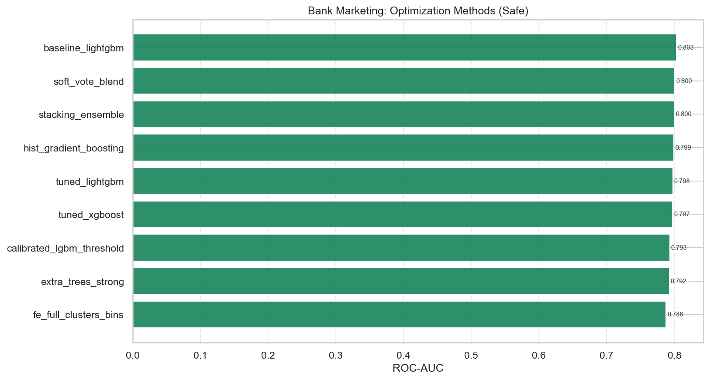
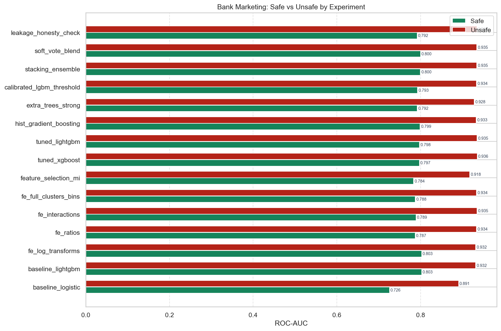
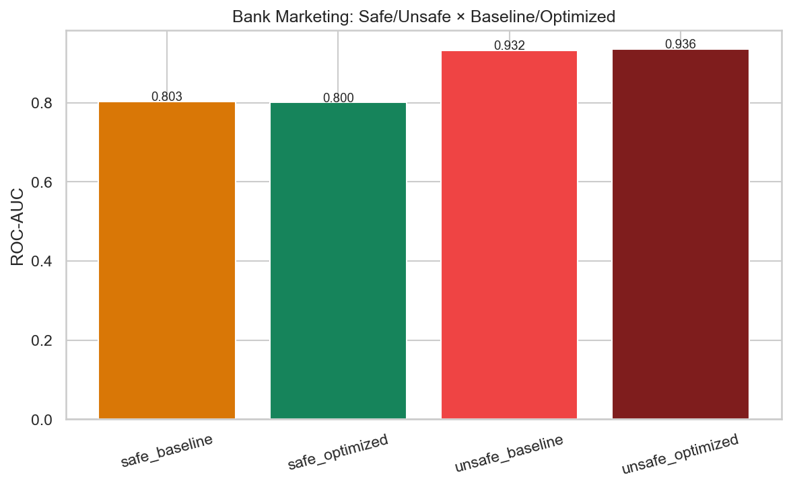

# Bank Marketing — Optimization Methods Report

**Question:** Which optimization methods lift ROC-AUC the most on this dataset?

---

## 1. Methods tested

| Method | Experiment | Description |
|---|---|---|
| none (baseline) | 02 baseline_lightgbm | Default LightGBM on raw features |
| FE only | 03–06 | Feature engineering without hyperparameter search |
| mutual_info_selection | 07 | Compact MI feature subset |
| RandomizedSearchCV | 08 tuned_xgboost, 09 tuned_lightgbm | 3-fold CV maximizing ROC-AUC |
| hand_tuned | 11 extra_trees_strong | Playbook ExtraTrees region |
| isotonic_calibration | 12 calibrated_lgbm | Probability calibration |
| oof_stacking | 13 stacking_ensemble | ET+LGBM+XGB → logistic meta |
| soft_probability_blend | 14 soft_vote_blend | Weighted probability average |

---

## 2. Safe-mode ranking (best → worst)

| Rank | Experiment | Method | ROC-AUC | F1 | Notes |
|---:|---|---|---:|---:|---|
| 1 | baseline_lightgbm | none | 0.8029 | 0.3333 | Strong GBDT baseline on raw features (HyperAck exp 02). |
| 2 | fe_log_transforms | none | 0.8029 | 0.3333 | Add log1p transforms for skewed non-negative columns. |
| 3 | soft_vote_blend | soft_probability_blend | 0.8002 | 0.3139 | Soft-vote blend ET+LGBM+XGB (HyperAck exp 15 / optimized safe champion style). |
| 4 | stacking_ensemble | oof_stacking | 0.7998 | 0.3380 | ET+LGBM+XGB stacked with logistic meta-learner (HyperAck exp 13). |
| 5 | hist_gradient_boosting | none | 0.7990 | 0.3180 | Sklearn HistGB on full FE (HyperAck exp 10). |
| 6 | tuned_lightgbm | RandomizedSearchCV_roc_auc | 0.7976 | 0.3248 | RandomizedSearchCV on LightGBM over full FE (HyperAck exp 09). |
| 7 | tuned_xgboost | RandomizedSearchCV_roc_auc | 0.7973 | 0.3105 | RandomizedSearchCV on XGBoost over full FE (HyperAck exp 08). |
| 8 | calibrated_lgbm_threshold | isotonic_calibration | 0.7930 | 0.3054 | Isotonic-calibrated LightGBM; threshold kept at 0.5 for ranking metrics. |
| 9 | extra_trees_strong | hand_tuned | 0.7924 | 0.2876 | Strong ExtraTrees (n=600, depth=14) on full FE. |
| 10 | leakage_honesty_check | none | 0.7919 | 0.3312 | Honesty marker: LightGBM on full FE under this mode. Compare safe vs unsafe of t |
| 11 | fe_interactions | none | 0.7892 | 0.3558 | Multiplicative interactions among top-MI features. |
| 12 | fe_full_clusters_bins | none | 0.7877 | 0.3502 | Full FE: logs+ratios+interactions+KMeans clusters+quantile bins (train-fit). |
| 13 | fe_ratios | none | 0.7872 | 0.3536 | Add pairwise intensity ratios among high-variance features. |
| 14 | feature_selection_mi | mutual_info_selection | 0.7837 | 0.3216 | Keep top-MI subset of full FE matrix (HyperAck exp 07). |
| 15 | baseline_logistic | none | 0.7260 | 0.2234 | Floor: logistic regression on raw features. |

**Winner:** `baseline_lightgbm` with method `none`  
**Best pure search method:** `soft_vote_blend` (`soft_probability_blend`)

---

## 3. Safe vs Optimized Safe

| Arm | Experiment | ROC-AUC | Recall | F1 |
|---|---|---:|---:|---:|
| Safe baseline | baseline_lightgbm | 0.8029 | — | — |
| Safe optimized (best) | baseline_lightgbm | 0.8029 | 0.2329 | 0.3333 |

Lift (best − baseline LGBM): see ranking table and `quadrant_safe_unsafe_opt.png`.

---

## 4. Unsafe vs Optimized Unsafe / Safe vs Unsafe

Leakage columns `['duration']` inflate unsafe scores.

| Experiment | Safe AUC | Unsafe AUC | Δ (leakage) | Safe Rec | Unsafe Rec |
|---|---:|---:|---:|---:|---:|
| baseline_lightgbm | 0.8029 | 0.9318 | +0.1289 | 0.2329 | 0.4915 |
| baseline_logistic | 0.7260 | 0.8910 | +0.1650 | 0.1346 | 0.2991 |
| calibrated_lgbm_threshold | 0.7930 | 0.9339 | +0.1410 | 0.1987 | 0.4829 |
| extra_trees_strong | 0.7924 | 0.9283 | +0.1359 | 0.1859 | 0.3632 |
| fe_full_clusters_bins | 0.7877 | 0.9337 | +0.1460 | 0.2436 | 0.4936 |
| fe_interactions | 0.7892 | 0.9353 | +0.1460 | 0.2479 | 0.5000 |
| fe_log_transforms | 0.8029 | 0.9318 | +0.1289 | 0.2329 | 0.4915 |
| fe_ratios | 0.7872 | 0.9337 | +0.1465 | 0.2543 | 0.4915 |
| feature_selection_mi | 0.7837 | 0.9177 | +0.1340 | 0.2244 | 0.4209 |
| hist_gradient_boosting | 0.7990 | 0.9332 | +0.1342 | 0.2137 | 0.4829 |
| leakage_honesty_check | 0.7919 | 0.9349 | +0.1429 | 0.2222 | 0.4701 |
| soft_vote_blend | 0.8002 | 0.9346 | +0.1344 | 0.2073 | 0.4338 |
| stacking_ensemble | 0.7998 | 0.9346 | +0.1348 | 0.2308 | 0.4808 |
| tuned_lightgbm | 0.7976 | 0.9354 | +0.1378 | 0.2158 | 0.4701 |
| tuned_xgboost | 0.7973 | 0.9357 | +0.1384 | 0.2030 | 0.4594 |

**Best unsafe:** `tuned_xgboost` AUC **0.9357**  
**Leakage cost (best unsafe − best safe):** +0.1328

---

## 5. Recommendation for production

1. Prefer **safe** features only when leakage columns exist.
2. Start from **full FE** then test MI selection.
3. Apply **RandomizedSearchCV** on LightGBM/XGBoost before stacking.
4. Use **soft-vote / stacking** only if they beat the best single tuned model on the locked test set.
