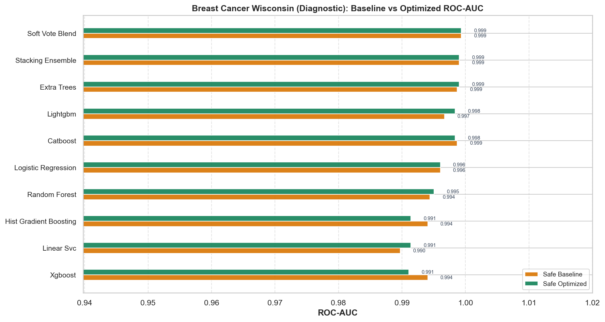
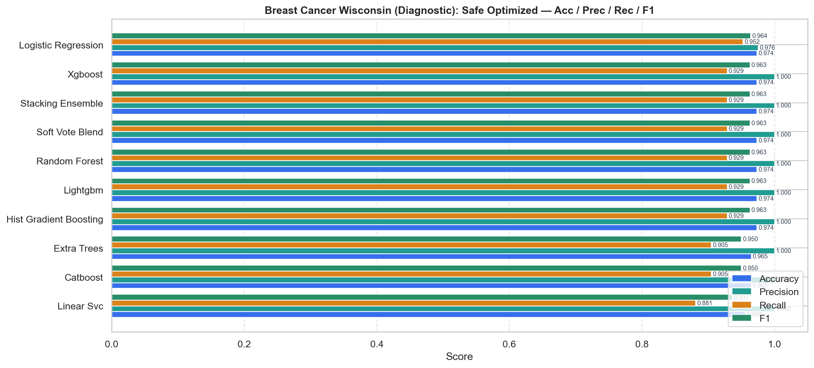
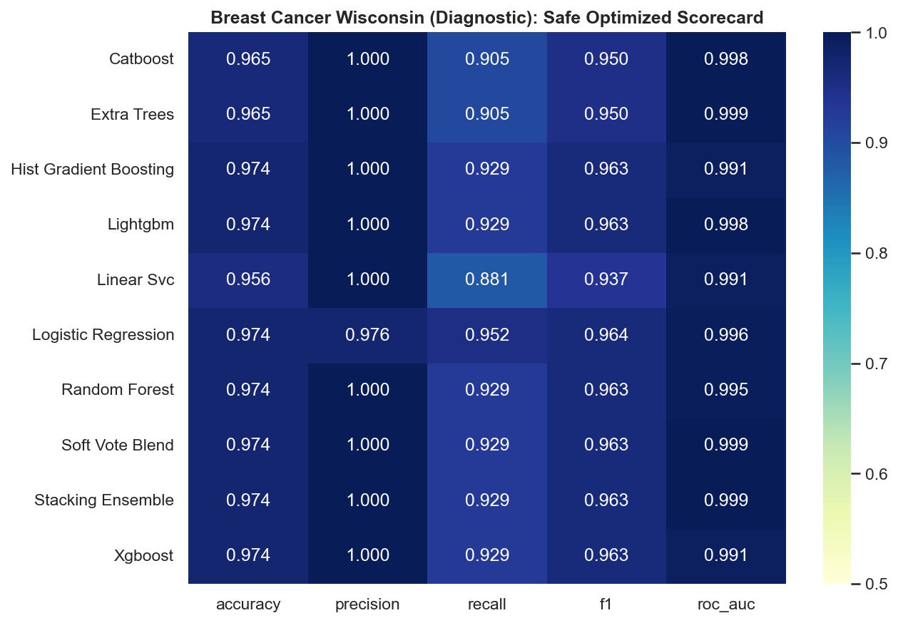
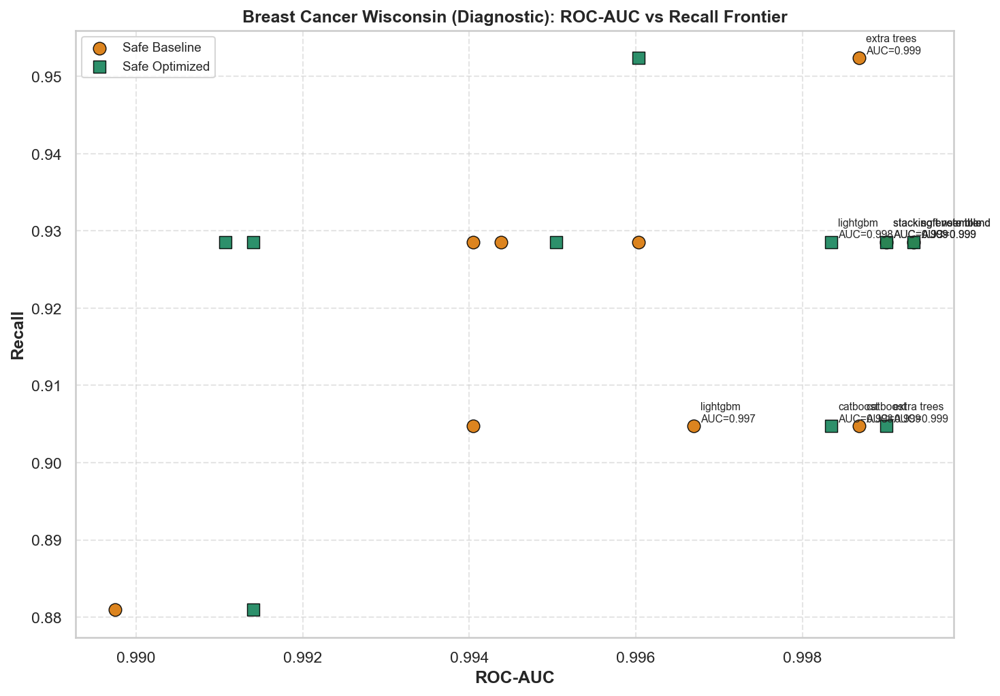
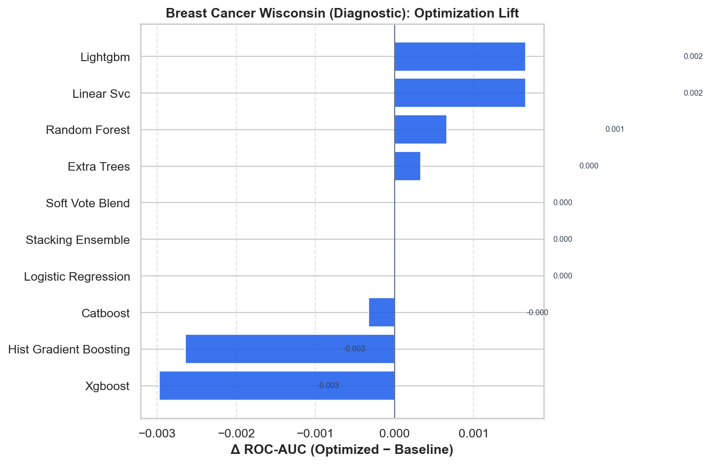

# Breast Cancer Wisconsin (Diagnostic) — Master Benchmark Report

HyperAck-style project folder: `external_projects/breast_cancer_exp/`

- **Source:** [https://archive.ics.uci.edu/dataset/17/breast+cancer+wisconsin+diagnostic](https://archive.ics.uci.edu/dataset/17/breast+cancer+wisconsin+diagnostic)
- **Description:** Binary diagnosis (malignant/benign) from cell nuclei measurements.
- **Split:** stratified 80/20, seed 42
- **Champion (safe optimized):** `soft_vote_blend` — ROC-AUC **0.9993**, F1 **0.9630**
- **Overall best:** `soft_vote_blend` (safe/optimized) — ROC-AUC **0.9993**

## Full results

| Mode | Opt | Model | ROC-AUC | Acc | Prec | Rec | F1 |
|---|---|---|---:|---:|---:|---:|---:|
| safe | baseline | soft_vote_blend | 0.9993 | 0.9737 | 1.0000 | 0.9286 | 0.9630 |
| safe | baseline | stacking_ensemble | 0.9990 | 0.9737 | 1.0000 | 0.9286 | 0.9630 |
| safe | baseline | extra_trees | 0.9987 | 0.9825 | 1.0000 | 0.9524 | 0.9756 |
| safe | baseline | catboost | 0.9987 | 0.9649 | 1.0000 | 0.9048 | 0.9500 |
| safe | baseline | lightgbm | 0.9967 | 0.9649 | 1.0000 | 0.9048 | 0.9500 |
| safe | baseline | logistic_regression | 0.9960 | 0.9649 | 0.9750 | 0.9286 | 0.9512 |
| safe | baseline | random_forest | 0.9944 | 0.9737 | 1.0000 | 0.9286 | 0.9630 |
| safe | baseline | xgboost | 0.9940 | 0.9737 | 1.0000 | 0.9286 | 0.9630 |
| safe | baseline | hist_gradient_boosting | 0.9940 | 0.9649 | 1.0000 | 0.9048 | 0.9500 |
| safe | baseline | linear_svc | 0.9897 | 0.9561 | 1.0000 | 0.8810 | 0.9367 |
| safe | optimized | soft_vote_blend | 0.9993 | 0.9737 | 1.0000 | 0.9286 | 0.9630 |
| safe | optimized | extra_trees | 0.9990 | 0.9649 | 1.0000 | 0.9048 | 0.9500 |
| safe | optimized | stacking_ensemble | 0.9990 | 0.9737 | 1.0000 | 0.9286 | 0.9630 |
| safe | optimized | lightgbm | 0.9983 | 0.9737 | 1.0000 | 0.9286 | 0.9630 |
| safe | optimized | catboost | 0.9983 | 0.9649 | 1.0000 | 0.9048 | 0.9500 |
| safe | optimized | logistic_regression | 0.9960 | 0.9737 | 0.9756 | 0.9524 | 0.9639 |
| safe | optimized | random_forest | 0.9950 | 0.9737 | 1.0000 | 0.9286 | 0.9630 |
| safe | optimized | hist_gradient_boosting | 0.9914 | 0.9737 | 1.0000 | 0.9286 | 0.9630 |
| safe | optimized | linear_svc | 0.9914 | 0.9561 | 1.0000 | 0.8810 | 0.9367 |
| safe | optimized | xgboost | 0.9911 | 0.9737 | 1.0000 | 0.9286 | 0.9630 |

## Figures











## Reproduce

```bash
.venv/bin/python external_projects/breast_cancer_exp/run_all.py
```
