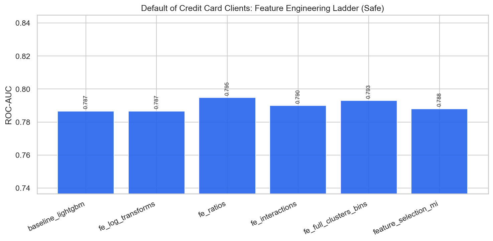

# Default of Credit Card Clients — Feature Engineering & Selection Report

**Project:** `external_projects/credit_default_exp/`  
**Source:** [https://archive.ics.uci.edu/dataset/350/default+of+credit+card+clients](https://archive.ics.uci.edu/dataset/350/default+of+credit+card+clients)  
**Rows / features (raw):** 30000 / 23  
**Positive rate:** 0.221  
**Protocol:** stratified 80/20, seed 42; all stateful FE fit on **train only**

---

## 1. Problem & decision-time policy

Predict next-month credit-card default from payment history.

### Leakage / safe vs unsafe
- **Has classic leakage columns:** False
- **Unsafe-only features:** `[]`
- **Rationale:** Payment history / bill amounts are known before predicting next-month default; no post-outcome leakage identified.

When leakage exists, **safe** drops post-outcome columns (HyperAck analog of final fares).  
When it does not, safe and unsafe matrices are identical — the ladder still documents FE and optimization lifts.

---

## 2. Feature engineering ladder (what we tried)

| Stage | Idea | Why (HyperAck playbook) |
|---|---|---|
| raw | Original numeric matrix | Floor score |
| logs | `log1p` on skewed non-negative cols | Tame heavy tails |
| ratios | Pairwise intensity ratios | Scale-normalized signals |
| interactions | Products of top-MI features | Non-linear combinations |
| full_fe | + KMeans clusters + quantile bins | Spatial/soft thresholds (train-fit) |
| selected | Top mutual-information subset | Test dilution vs compact set |

---

## 3. Safe-mode experiment results

| ID | Experiment | FE stage | #Feats | ROC-AUC | Recall | F1 | Optimization |
|---|---|---|---:|---:|---:|---:|---|
| 01 | baseline_logistic | raw | 23 | 0.7209 | 0.2531 | 0.3755 | none |
| 02 | baseline_lightgbm | raw | 23 | 0.7867 | 0.3785 | 0.4880 | none |
| 03 | fe_log_transforms | logs | 31 | 0.7867 | 0.3785 | 0.4880 | none |
| 04 | fe_ratios | ratios | 46 | 0.7948 | 0.3751 | 0.4900 | none |
| 05 | fe_interactions | interactions | 54 | 0.7899 | 0.3718 | 0.4870 | none |
| 06 | fe_full_clusters_bins | full_fe | 59 | 0.7930 | 0.3661 | 0.4775 | none |
| 07 | feature_selection_mi | selected | 25 | 0.7880 | 0.3672 | 0.4779 | mutual_info_selection |
| 08 | tuned_xgboost | full_fe | 59 | 0.7988 | 0.3661 | 0.4825 | RandomizedSearchCV_roc_auc |
| 09 | tuned_lightgbm | full_fe | 59 | 0.7985 | 0.3638 | 0.4802 | RandomizedSearchCV_roc_auc |
| 10 | hist_gradient_boosting | full_fe | 59 | 0.7973 | 0.3718 | 0.4874 | none |
| 11 | extra_trees_strong | full_fe | 59 | 0.7957 | 0.3650 | 0.4789 | hand_tuned |
| 12 | calibrated_lgbm_threshold | full_fe | 59 | 0.7929 | 0.3616 | 0.4762 | isotonic_calibration |
| 13 | stacking_ensemble | full_fe | 59 | 0.8005 | 0.3706 | 0.4848 | oof_stacking |
| 14 | soft_vote_blend | full_fe | 59 | 0.7996 | 0.3706 | 0.4863 | soft_probability_blend |
| 15 | leakage_honesty_check | full_fe | 59 | 0.7996 | 0.3706 | 0.4866 | none |

**Best safe model:** `stacking_ensemble` — ROC-AUC **0.8005**, F1 **0.4848**  
**Best optimization method (safe):** `oof_stacking` via `stacking_ensemble` (AUC 0.8005)

### FE stage chart

---

## 4. Feature selection findings

Experiment `07 feature_selection_mi` keeps a top-MI subset of the full FE matrix.  
Compare its ROC-AUC against `06 fe_full_clusters_bins`:

- Full FE AUC: **0.7930** (59 feats)
- Selected AUC: **0.7880** (25 feats)
- Δ: **-0.0049** — full FE retained more signal (dilution not an issue / selection too aggressive).

---

## 5. Figures
- `benchmark_outputs/fe_ladder_safe.png`
- `benchmark_outputs/safe_vs_unsafe_by_experiment.png`
- `benchmark_outputs/ladder_results.csv`
