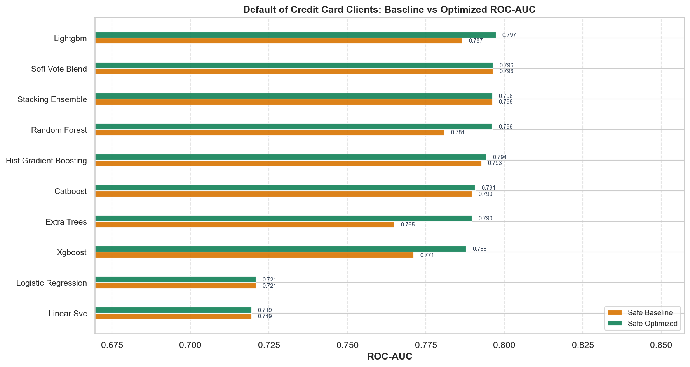
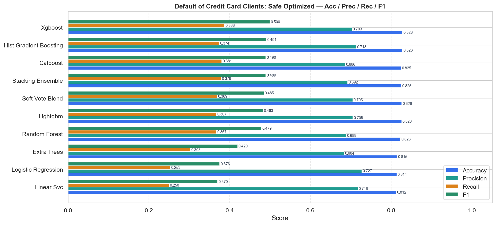
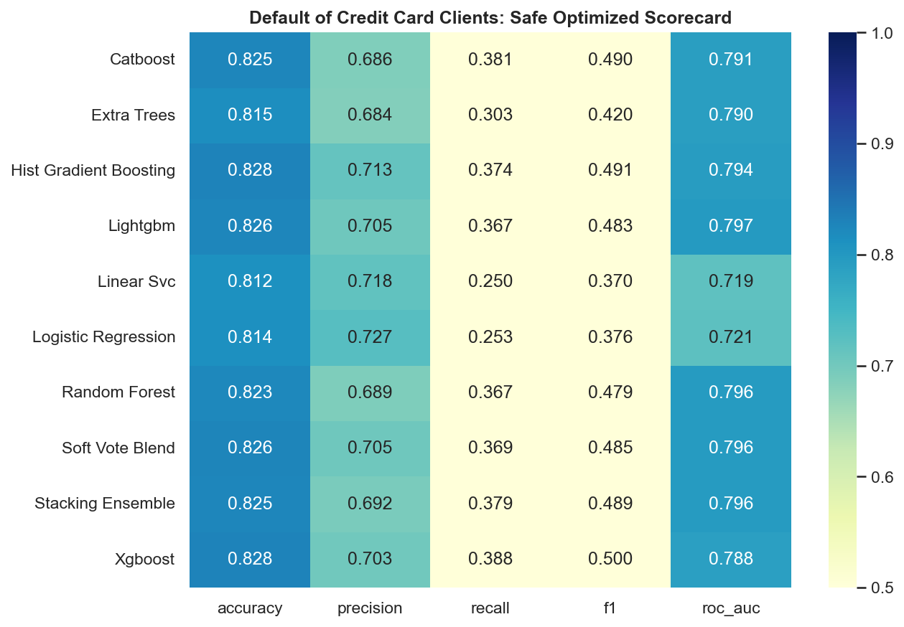
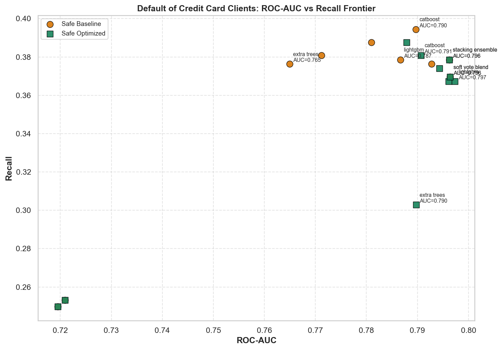
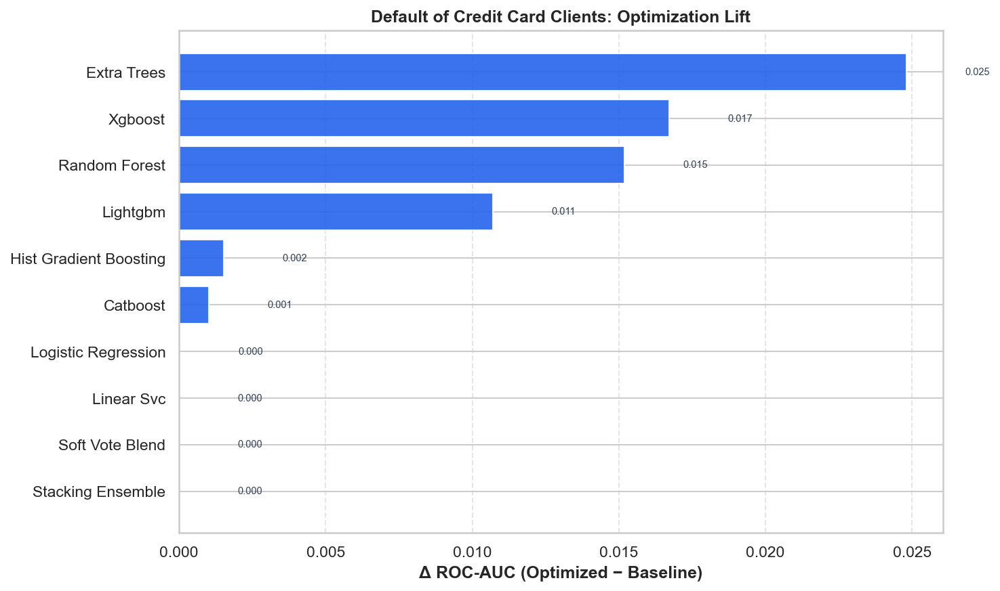

# Default of Credit Card Clients — Master Benchmark Report

HyperAck-style project folder: `external_projects/credit_default_exp/`

- **Source:** [https://archive.ics.uci.edu/dataset/350/default+of+credit+card+clients](https://archive.ics.uci.edu/dataset/350/default+of+credit+card+clients)
- **Description:** Predict next-month credit-card default from payment history.
- **Split:** stratified 80/20, seed 42
- **Champion (safe optimized):** `lightgbm` — ROC-AUC **0.7974**, F1 **0.4829**
- **Overall best:** `lightgbm` (safe/optimized) — ROC-AUC **0.7974**

## Full results

| Mode | Opt | Model | ROC-AUC | Acc | Prec | Rec | F1 |
|---|---|---|---:|---:|---:|---:|---:|
| safe | baseline | soft_vote_blend | 0.7964 | 0.8263 | 0.7047 | 0.3695 | 0.4848 |
| safe | baseline | stacking_ensemble | 0.7962 | 0.8253 | 0.6921 | 0.3785 | 0.4894 |
| safe | baseline | hist_gradient_boosting | 0.7928 | 0.8275 | 0.7070 | 0.3763 | 0.4912 |
| safe | baseline | catboost | 0.7897 | 0.8267 | 0.6897 | 0.3944 | 0.5018 |
| safe | baseline | lightgbm | 0.7867 | 0.8243 | 0.6865 | 0.3785 | 0.4880 |
| safe | baseline | random_forest | 0.7810 | 0.8237 | 0.6779 | 0.3876 | 0.4932 |
| safe | baseline | xgboost | 0.7712 | 0.8175 | 0.6493 | 0.3808 | 0.4801 |
| safe | baseline | extra_trees | 0.7649 | 0.8135 | 0.6319 | 0.3763 | 0.4717 |
| safe | baseline | logistic_regression | 0.7209 | 0.8137 | 0.7273 | 0.2531 | 0.3755 |
| safe | baseline | linear_svc | 0.7195 | 0.8123 | 0.7175 | 0.2497 | 0.3705 |
| safe | optimized | lightgbm | 0.7974 | 0.8260 | 0.7050 | 0.3672 | 0.4829 |
| safe | optimized | soft_vote_blend | 0.7964 | 0.8263 | 0.7047 | 0.3695 | 0.4848 |
| safe | optimized | stacking_ensemble | 0.7962 | 0.8253 | 0.6921 | 0.3785 | 0.4894 |
| safe | optimized | random_forest | 0.7961 | 0.8233 | 0.6886 | 0.3672 | 0.4790 |
| safe | optimized | hist_gradient_boosting | 0.7943 | 0.8283 | 0.7134 | 0.3740 | 0.4907 |
| safe | optimized | catboost | 0.7907 | 0.8245 | 0.6864 | 0.3808 | 0.4898 |
| safe | optimized | extra_trees | 0.7897 | 0.8147 | 0.6837 | 0.3028 | 0.4197 |
| safe | optimized | xgboost | 0.7879 | 0.8283 | 0.7029 | 0.3876 | 0.4996 |
| safe | optimized | logistic_regression | 0.7209 | 0.8137 | 0.7273 | 0.2531 | 0.3755 |
| safe | optimized | linear_svc | 0.7195 | 0.8123 | 0.7175 | 0.2497 | 0.3705 |

## Figures











## Reproduce

```bash
.venv/bin/python external_projects/credit_default_exp/run_all.py
```
