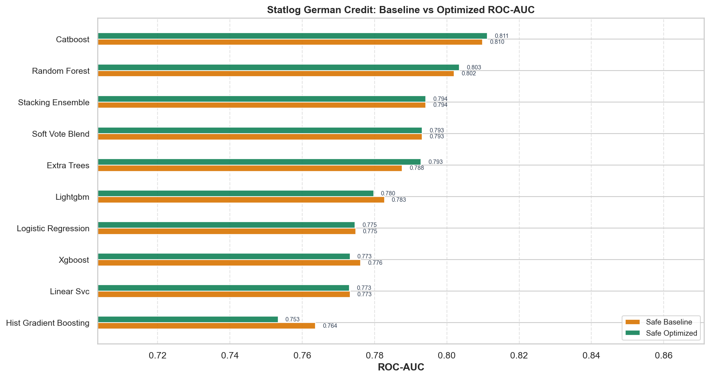
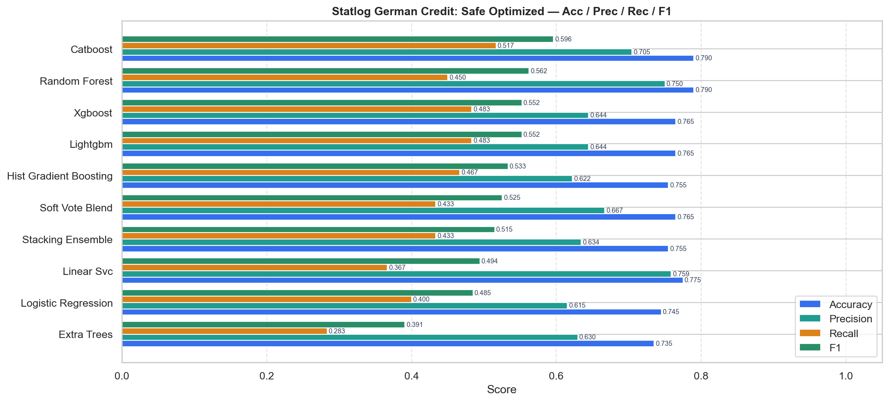
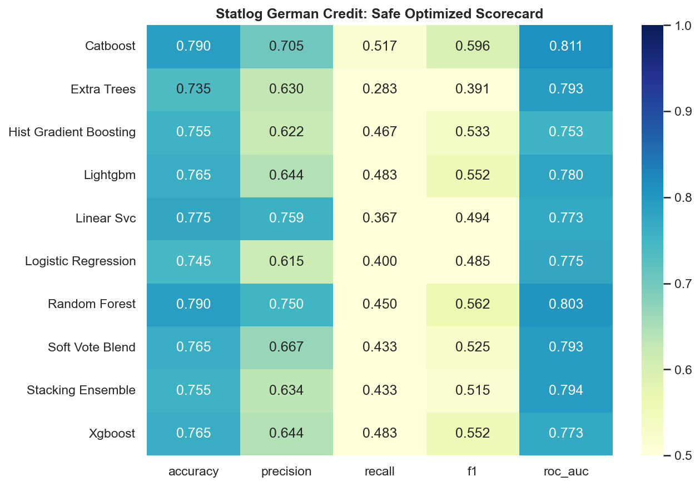
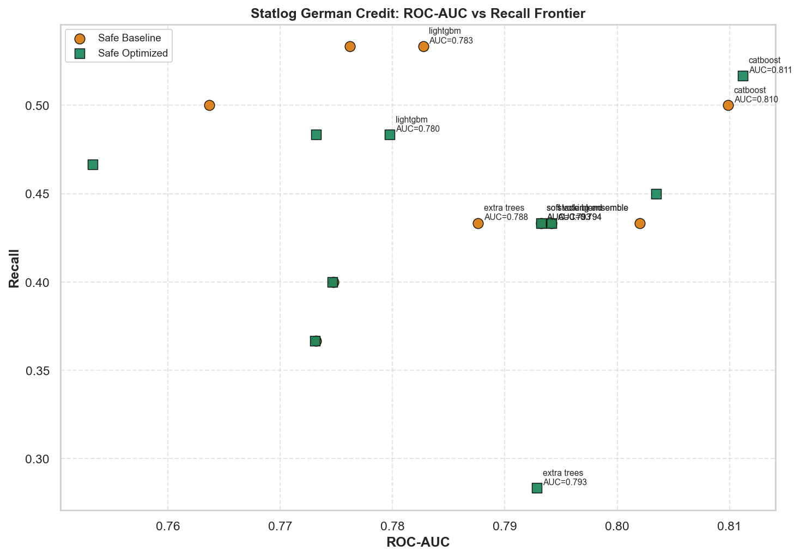
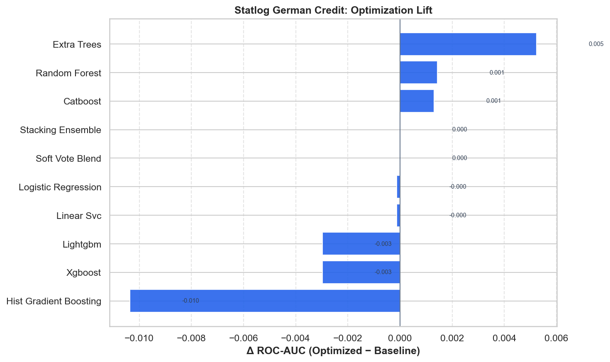

# Statlog German Credit — Master Benchmark Report

HyperAck-style project folder: `external_projects/german_credit_exp/`

- **Source:** [https://archive.ics.uci.edu/dataset/144/statlog+german+credit+data](https://archive.ics.uci.edu/dataset/144/statlog+german+credit+data)
- **Description:** Classify credit applicants as good/bad risk.
- **Split:** stratified 80/20, seed 42
- **Champion (safe optimized):** `catboost` — ROC-AUC **0.8112**, F1 **0.5962**
- **Overall best:** `catboost` (safe/optimized) — ROC-AUC **0.8112**

## Full results

| Mode | Opt | Model | ROC-AUC | Acc | Prec | Rec | F1 |
|---|---|---|---:|---:|---:|---:|---:|
| safe | baseline | catboost | 0.8099 | 0.7750 | 0.6667 | 0.5000 | 0.5714 |
| safe | baseline | random_forest | 0.8020 | 0.7850 | 0.7429 | 0.4333 | 0.5474 |
| safe | baseline | stacking_ensemble | 0.7942 | 0.7550 | 0.6341 | 0.4333 | 0.5149 |
| safe | baseline | soft_vote_blend | 0.7932 | 0.7650 | 0.6667 | 0.4333 | 0.5253 |
| safe | baseline | extra_trees | 0.7876 | 0.7800 | 0.7222 | 0.4333 | 0.5417 |
| safe | baseline | lightgbm | 0.7827 | 0.7600 | 0.6154 | 0.5333 | 0.5714 |
| safe | baseline | xgboost | 0.7762 | 0.7700 | 0.6400 | 0.5333 | 0.5818 |
| safe | baseline | logistic_regression | 0.7748 | 0.7450 | 0.6154 | 0.4000 | 0.4848 |
| safe | baseline | linear_svc | 0.7732 | 0.7750 | 0.7586 | 0.3667 | 0.4944 |
| safe | baseline | hist_gradient_boosting | 0.7637 | 0.7650 | 0.6383 | 0.5000 | 0.5607 |
| safe | optimized | catboost | 0.8112 | 0.7900 | 0.7045 | 0.5167 | 0.5962 |
| safe | optimized | random_forest | 0.8035 | 0.7900 | 0.7500 | 0.4500 | 0.5625 |
| safe | optimized | stacking_ensemble | 0.7942 | 0.7550 | 0.6341 | 0.4333 | 0.5149 |
| safe | optimized | soft_vote_blend | 0.7932 | 0.7650 | 0.6667 | 0.4333 | 0.5253 |
| safe | optimized | extra_trees | 0.7929 | 0.7350 | 0.6296 | 0.2833 | 0.3908 |
| safe | optimized | lightgbm | 0.7798 | 0.7650 | 0.6444 | 0.4833 | 0.5524 |
| safe | optimized | logistic_regression | 0.7746 | 0.7450 | 0.6154 | 0.4000 | 0.4848 |
| safe | optimized | xgboost | 0.7732 | 0.7650 | 0.6444 | 0.4833 | 0.5524 |
| safe | optimized | linear_svc | 0.7731 | 0.7750 | 0.7586 | 0.3667 | 0.4944 |
| safe | optimized | hist_gradient_boosting | 0.7533 | 0.7550 | 0.6222 | 0.4667 | 0.5333 |

## Figures











## Reproduce

```bash
.venv/bin/python external_projects/german_credit_exp/run_all.py
```
