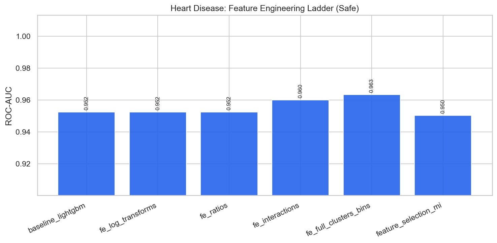

# Heart Disease — Feature Engineering & Selection Report

**Project:** `external_projects/heart_disease_exp/`  
**Source:** [https://archive.ics.uci.edu/dataset/45/heart+disease](https://archive.ics.uci.edu/dataset/45/heart+disease)  
**Rows / features (raw):** 303 / 13  
**Positive rate:** 0.459  
**Protocol:** stratified 80/20, seed 42; all stateful FE fit on **train only**

---

## 1. Problem & decision-time policy

Predict presence of heart disease from clinical attributes.

### Leakage / safe vs unsafe
- **Has classic leakage columns:** False
- **Unsafe-only features:** `[]`
- **Rationale:** Clinical attributes are pre-diagnosis; no post-outcome leakage identified.

When leakage exists, **safe** drops post-outcome columns (HyperAck analog of final fares).  
When it does not, safe and unsafe matrices are identical — the ladder still documents FE and optimization lifts.

---

## 2. Feature engineering ladder (what we tried)

| Stage | Idea | Why (HyperAck playbook) |
|---|---|---|
| raw | Original numeric matrix | Floor score |
| logs | `log1p` on skewed non-negative cols | Tame heavy tails |
| ratios | Pairwise intensity ratios | Scale-normalized signals |
| interactions | Products of top-MI features | Non-linear combinations |
| full_fe | + KMeans clusters + quantile bins | Spatial/soft thresholds (train-fit) |
| selected | Top mutual-information subset | Test dilution vs compact set |

---

## 3. Safe-mode experiment results

| ID | Experiment | FE stage | #Feats | ROC-AUC | Recall | F1 | Optimization |
|---|---|---|---:|---:|---:|---:|---|
| 01 | baseline_logistic | raw | 13 | 0.9513 | 0.9286 | 0.8667 | none |
| 02 | baseline_lightgbm | raw | 13 | 0.9524 | 0.9286 | 0.8814 | none |
| 03 | fe_log_transforms | logs | 18 | 0.9524 | 0.9286 | 0.8814 | none |
| 04 | fe_ratios | ratios | 33 | 0.9524 | 0.9286 | 0.8814 | none |
| 05 | fe_interactions | interactions | 41 | 0.9600 | 0.9643 | 0.8852 | none |
| 06 | fe_full | full_fe | 46 | 0.9632 | 0.9643 | 0.8852 | none |
| 06 | fe_full_clusters_bins | full_fe | 46 | 0.9632 | 0.9643 | 0.8852 | none |
| 07 | feature_selection_mi | selected | 25 | 0.9502 | 0.9643 | 0.8571 | mutual_info_selection |
| 08 | tuned_xgboost | full_fe | 46 | 0.9535 | 0.9286 | 0.8814 | RandomizedSearchCV_roc_auc |
| 09 | tuned_lightgbm | full_fe | 46 | 0.9545 | 0.8929 | 0.8621 | RandomizedSearchCV_roc_auc |
| 10 | hist_gradient_boosting | full_fe | 46 | 0.9740 | 0.9643 | 0.9153 | none |
| 11 | extra_trees_strong | full_fe | 46 | 0.9340 | 0.8214 | 0.8070 | hand_tuned |
| 12 | calibrated_lgbm_threshold | full_fe | 46 | 0.9535 | 0.9286 | 0.8814 | isotonic_calibration |
| 13 | stacking_ensemble | full_fe | 46 | 0.9470 | 0.8929 | 0.8621 | oof_stacking |
| 14 | soft_vote_blend | full_fe | 46 | 0.9491 | 0.8929 | 0.8475 | soft_probability_blend |
| 15 | leakage_honesty_check | full_fe | 46 | 0.9665 | 0.9643 | 0.8852 | none |

**Best safe model:** `hist_gradient_boosting` — ROC-AUC **0.9740**, F1 **0.9153**  
**Best optimization method (safe):** `RandomizedSearchCV_roc_auc` via `tuned_lightgbm` (AUC 0.9545)

### FE stage chart

---

## 4. Feature selection findings

Experiment `07 feature_selection_mi` keeps a top-MI subset of the full FE matrix.  
Compare its ROC-AUC against `06 fe_full_clusters_bins`:

- Full FE AUC: **0.9632** (46 feats)
- Selected AUC: **0.9502** (25 feats)
- Δ: **-0.0130** — full FE retained more signal (dilution not an issue / selection too aggressive).

---

## 5. Figures
- `benchmark_outputs/fe_ladder_safe.png`
- `benchmark_outputs/safe_vs_unsafe_by_experiment.png`
- `benchmark_outputs/ladder_results.csv`
