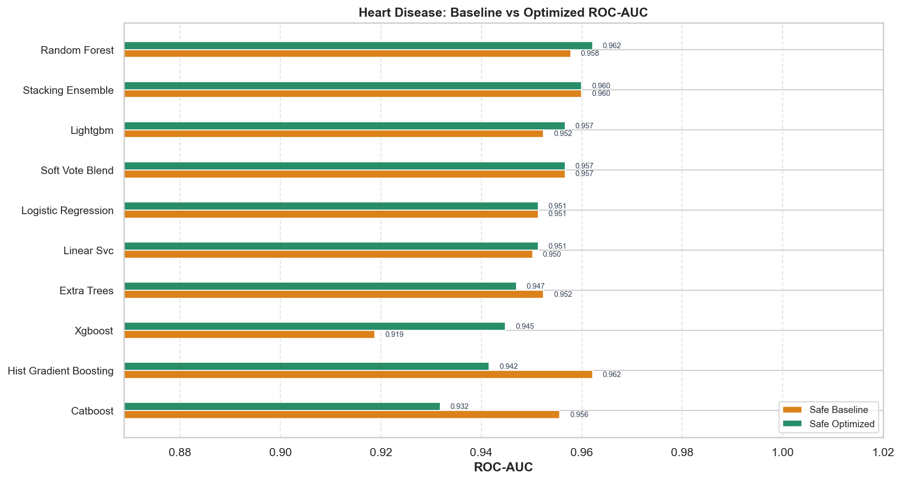
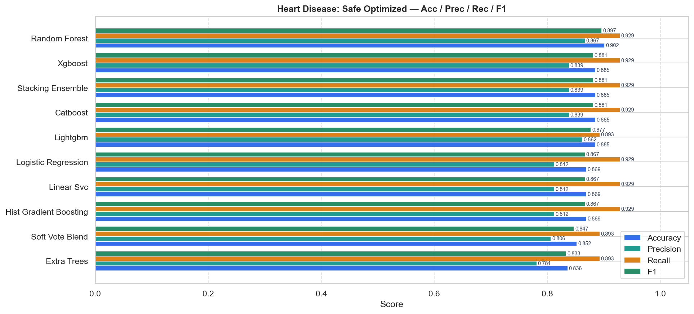
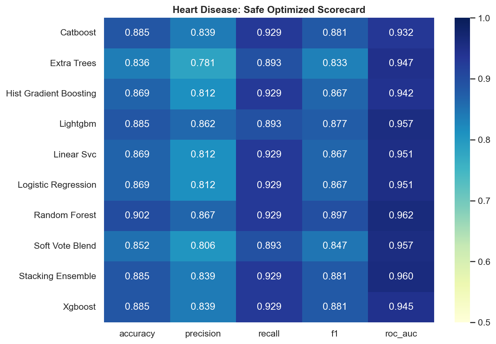
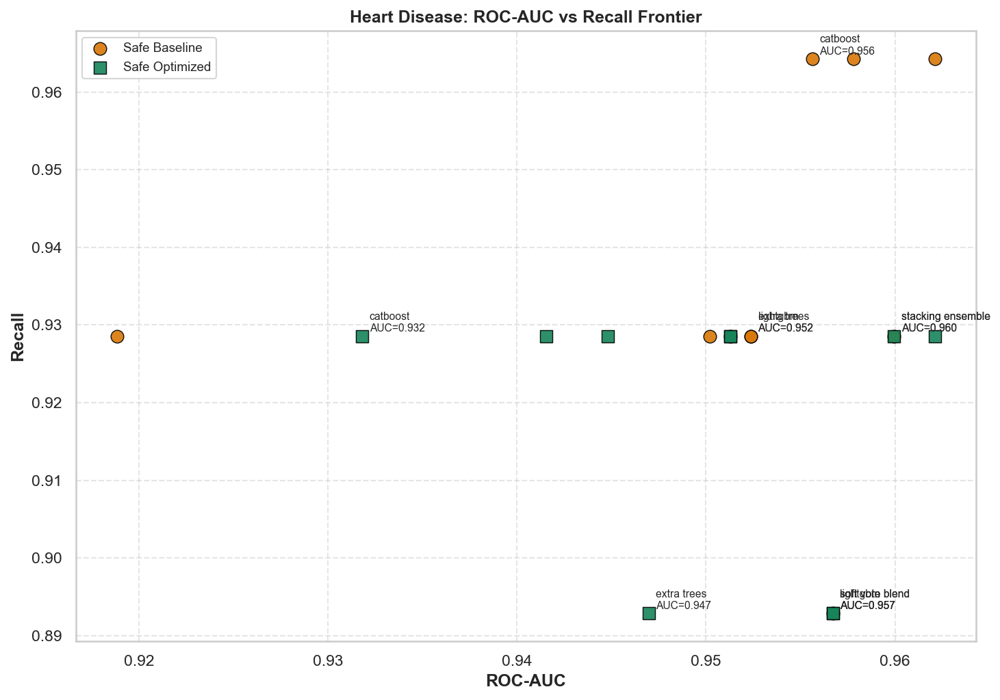
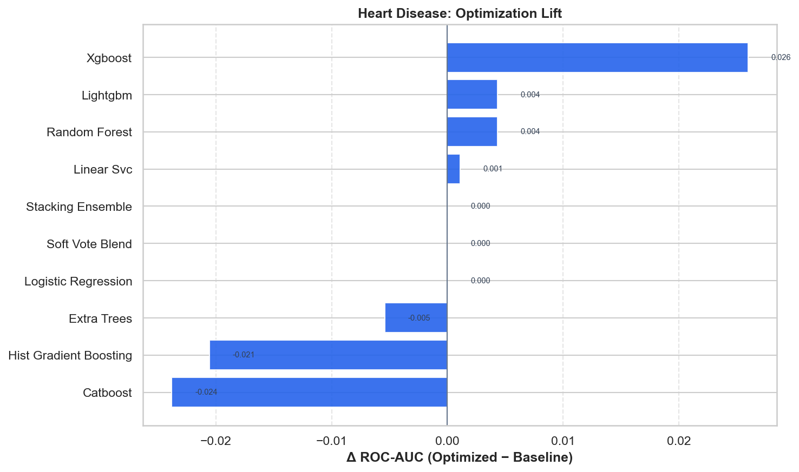

# Heart Disease — Master Benchmark Report

HyperAck-style project folder: `external_projects/heart_disease_exp/`

- **Source:** [https://archive.ics.uci.edu/dataset/45/heart+disease](https://archive.ics.uci.edu/dataset/45/heart+disease)
- **Description:** Predict presence of heart disease from clinical attributes.
- **Split:** stratified 80/20, seed 42
- **Champion (safe optimized):** `random_forest` — ROC-AUC **0.9621**, F1 **0.8966**
- **Overall best:** `random_forest` (safe/optimized) — ROC-AUC **0.9621**

## Full results

| Mode | Opt | Model | ROC-AUC | Acc | Prec | Rec | F1 |
|---|---|---|---:|---:|---:|---:|---:|
| safe | baseline | hist_gradient_boosting | 0.9621 | 0.9344 | 0.9000 | 0.9643 | 0.9310 |
| safe | baseline | stacking_ensemble | 0.9600 | 0.8852 | 0.8387 | 0.9286 | 0.8814 |
| safe | baseline | random_forest | 0.9578 | 0.9180 | 0.8710 | 0.9643 | 0.9153 |
| safe | baseline | soft_vote_blend | 0.9567 | 0.8525 | 0.8065 | 0.8929 | 0.8475 |
| safe | baseline | catboost | 0.9556 | 0.8852 | 0.8182 | 0.9643 | 0.8852 |
| safe | baseline | extra_trees | 0.9524 | 0.8361 | 0.7647 | 0.9286 | 0.8387 |
| safe | baseline | lightgbm | 0.9524 | 0.8852 | 0.8387 | 0.9286 | 0.8814 |
| safe | baseline | logistic_regression | 0.9513 | 0.8689 | 0.8125 | 0.9286 | 0.8667 |
| safe | baseline | linear_svc | 0.9502 | 0.8689 | 0.8125 | 0.9286 | 0.8667 |
| safe | baseline | xgboost | 0.9188 | 0.8525 | 0.7879 | 0.9286 | 0.8525 |
| safe | optimized | random_forest | 0.9621 | 0.9016 | 0.8667 | 0.9286 | 0.8966 |
| safe | optimized | stacking_ensemble | 0.9600 | 0.8852 | 0.8387 | 0.9286 | 0.8814 |
| safe | optimized | lightgbm | 0.9567 | 0.8852 | 0.8621 | 0.8929 | 0.8772 |
| safe | optimized | soft_vote_blend | 0.9567 | 0.8525 | 0.8065 | 0.8929 | 0.8475 |
| safe | optimized | linear_svc | 0.9513 | 0.8689 | 0.8125 | 0.9286 | 0.8667 |
| safe | optimized | logistic_regression | 0.9513 | 0.8689 | 0.8125 | 0.9286 | 0.8667 |
| safe | optimized | extra_trees | 0.9470 | 0.8361 | 0.7812 | 0.8929 | 0.8333 |
| safe | optimized | xgboost | 0.9448 | 0.8852 | 0.8387 | 0.9286 | 0.8814 |
| safe | optimized | hist_gradient_boosting | 0.9416 | 0.8689 | 0.8125 | 0.9286 | 0.8667 |
| safe | optimized | catboost | 0.9318 | 0.8852 | 0.8387 | 0.9286 | 0.8814 |

## Figures











## Reproduce

```bash
.venv/bin/python external_projects/heart_disease_exp/run_all.py
```
