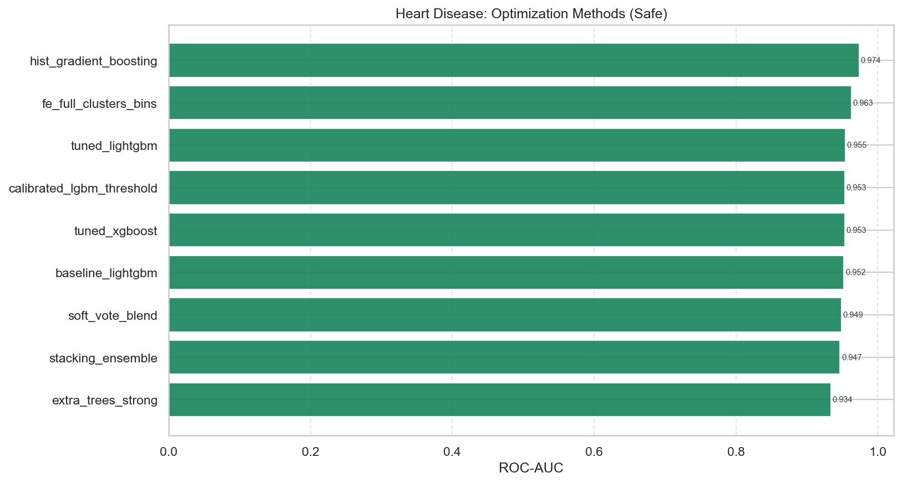

# Heart Disease — Optimization Methods Report

**Question:** Which optimization methods lift ROC-AUC the most on this dataset?

---

## 1. Methods tested

| Method | Experiment | Description |
|---|---|---|
| none (baseline) | 02 baseline_lightgbm | Default LightGBM on raw features |
| FE only | 03–06 | Feature engineering without hyperparameter search |
| mutual_info_selection | 07 | Compact MI feature subset |
| RandomizedSearchCV | 08 tuned_xgboost, 09 tuned_lightgbm | 3-fold CV maximizing ROC-AUC |
| hand_tuned | 11 extra_trees_strong | Playbook ExtraTrees region |
| isotonic_calibration | 12 calibrated_lgbm | Probability calibration |
| oof_stacking | 13 stacking_ensemble | ET+LGBM+XGB → logistic meta |
| soft_probability_blend | 14 soft_vote_blend | Weighted probability average |

---

## 2. Safe-mode ranking (best → worst)

| Rank | Experiment | Method | ROC-AUC | F1 | Notes |
|---:|---|---|---:|---:|---|
| 1 | hist_gradient_boosting | none | 0.9740 | 0.9153 | Sklearn HistGB on full FE (HyperAck exp 10). |
| 2 | leakage_honesty_check | none | 0.9665 | 0.8852 | Honesty marker: LightGBM on full FE under this mode. Compare safe vs unsafe of t |
| 3 | fe_full | none | 0.9632 | 0.8852 |  |
| 4 | fe_full_clusters_bins | none | 0.9632 | 0.8852 | Full FE: logs+ratios+interactions+KMeans clusters+quantile bins (train-fit). |
| 5 | fe_interactions | none | 0.9600 | 0.8852 | Multiplicative interactions among top-MI features. |
| 6 | tuned_lightgbm | RandomizedSearchCV_roc_auc | 0.9545 | 0.8621 | RandomizedSearchCV on LightGBM over full FE (HyperAck exp 09). |
| 7 | tuned_xgboost | RandomizedSearchCV_roc_auc | 0.9535 | 0.8814 | RandomizedSearchCV on XGBoost over full FE (HyperAck exp 08). |
| 8 | calibrated_lgbm_threshold | isotonic_calibration | 0.9535 | 0.8814 | Isotonic-calibrated LightGBM; threshold kept at 0.5 for ranking metrics. |
| 9 | baseline_lightgbm | none | 0.9524 | 0.8814 | Strong GBDT baseline on raw features (HyperAck exp 02). |
| 10 | fe_log_transforms | none | 0.9524 | 0.8814 | Add log1p transforms for skewed non-negative columns. |
| 11 | fe_ratios | none | 0.9524 | 0.8814 | Add pairwise intensity ratios among high-variance features. |
| 12 | baseline_logistic | none | 0.9513 | 0.8667 | Floor: logistic regression on raw features. |
| 13 | feature_selection_mi | mutual_info_selection | 0.9502 | 0.8571 | Keep top-MI subset of full FE matrix (HyperAck exp 07). |
| 14 | soft_vote_blend | soft_probability_blend | 0.9491 | 0.8475 | Soft-vote blend ET+LGBM+XGB (HyperAck exp 15 / optimized safe champion style). |
| 15 | stacking_ensemble | oof_stacking | 0.9470 | 0.8621 | ET+LGBM+XGB stacked with logistic meta-learner (HyperAck exp 13). |
| 16 | extra_trees_strong | hand_tuned | 0.9340 | 0.8070 | Strong ExtraTrees (n=600, depth=14) on full FE. |

**Winner:** `hist_gradient_boosting` with method `none`  
**Best pure search method:** `tuned_lightgbm` (`RandomizedSearchCV_roc_auc`)

---

## 3. Safe vs Optimized Safe

| Arm | Experiment | ROC-AUC | Recall | F1 |
|---|---|---:|---:|---:|
| Safe baseline | baseline_lightgbm | 0.9524 | — | — |
| Safe optimized (best) | hist_gradient_boosting | 0.9740 | 0.9643 | 0.9153 |

Lift (best − baseline LGBM): see ranking table and `quadrant_safe_unsafe_opt.png`.

---

## 4. Unsafe vs Optimized Unsafe / Safe vs Unsafe

No post-outcome leakage columns for this dataset — safe and unsafe feature matrices are **identical**. Differences across modes (if any) are numerical noise only. Focus optimization comparisons on the safe ranking above.

---

## 5. Recommendation for production

1. Prefer **safe** features only when leakage columns exist.
2. Start from **full FE** then test MI selection.
3. Apply **RandomizedSearchCV** on LightGBM/XGBoost before stacking.
4. Use **soft-vote / stacking** only if they beat the best single tuned model on the locked test set.
