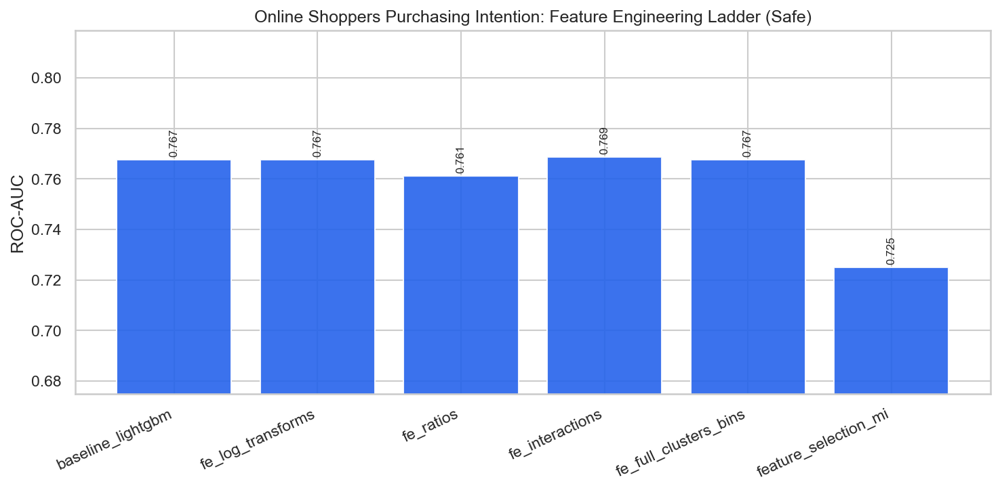

# Online Shoppers Purchasing Intention — Feature Engineering & Selection Report

**Project:** `external_projects/online_shoppers_exp/`  
**Source:** [https://archive.ics.uci.edu/dataset/468/online+shoppers+purchasing+intention+dataset](https://archive.ics.uci.edu/dataset/468/online+shoppers+purchasing+intention+dataset)  
**Rows / features (raw):** 12330 / 17  
**Positive rate:** 0.155  
**Protocol:** stratified 80/20, seed 42; all stateful FE fit on **train only**

---

## 1. Problem & decision-time policy

Predict whether a session ends in a purchase (e-commerce intent).

### Leakage / safe vs unsafe
- **Has classic leakage columns:** True
- **Unsafe-only features:** `['PageValues']`
- **Rationale:** `PageValues` is a Google Analytics metric tightly coupled to purchase intent and can act as a near-outcome proxy. Safe mode drops it for an honest pre-purchase decision model.

When leakage exists, **safe** drops post-outcome columns (HyperAck analog of final fares).  
When it does not, safe and unsafe matrices are identical — the ladder still documents FE and optimization lifts.

---

## 2. Feature engineering ladder (what we tried)

| Stage | Idea | Why (HyperAck playbook) |
|---|---|---|
| raw | Original numeric matrix | Floor score |
| logs | `log1p` on skewed non-negative cols | Tame heavy tails |
| ratios | Pairwise intensity ratios | Scale-normalized signals |
| interactions | Products of top-MI features | Non-linear combinations |
| full_fe | + KMeans clusters + quantile bins | Spatial/soft thresholds (train-fit) |
| selected | Top mutual-information subset | Test dilution vs compact set |

---

## 3. Safe-mode experiment results

| ID | Experiment | FE stage | #Feats | ROC-AUC | Recall | F1 | Optimization |
|---|---|---|---:|---:|---:|---:|---|
| 01 | baseline_logistic | raw | 16 | 0.7048 | 0.0052 | 0.0104 | none |
| 02 | baseline_lightgbm | raw | 16 | 0.7675 | 0.1204 | 0.1962 | none |
| 03 | fe_log_transforms | logs | 31 | 0.7675 | 0.1204 | 0.1962 | none |
| 04 | fe_ratios | ratios | 46 | 0.7612 | 0.1021 | 0.1656 | none |
| 05 | fe_interactions | interactions | 54 | 0.7687 | 0.1230 | 0.1942 | none |
| 06 | fe_full_clusters_bins | full_fe | 59 | 0.7675 | 0.1126 | 0.1807 | none |
| 07 | feature_selection_mi | selected | 25 | 0.7250 | 0.0288 | 0.0507 | mutual_info_selection |
| 08 | tuned_xgboost | full_fe | 59 | 0.7737 | 0.0681 | 0.1212 | RandomizedSearchCV_roc_auc |
| 09 | tuned_lightgbm | full_fe | 59 | 0.7719 | 0.0681 | 0.1209 | RandomizedSearchCV_roc_auc |
| 10 | hist_gradient_boosting | full_fe | 59 | 0.7696 | 0.1257 | 0.2008 | none |
| 11 | extra_trees_strong | full_fe | 59 | 0.7532 | 0.0105 | 0.0203 | hand_tuned |
| 12 | calibrated_lgbm_threshold | full_fe | 59 | 0.7648 | 0.0052 | 0.0103 | isotonic_calibration |
| 13 | stacking_ensemble | full_fe | 59 | 0.7712 | 0.1361 | 0.2118 | oof_stacking |
| 14 | soft_vote_blend | full_fe | 59 | 0.7735 | 0.0497 | 0.0903 | soft_probability_blend |
| 15 | leakage_honesty_check | full_fe | 59 | 0.7714 | 0.1021 | 0.1718 | none |

**Best safe model:** `tuned_xgboost` — ROC-AUC **0.7737**, F1 **0.1212**  
**Best optimization method (safe):** `RandomizedSearchCV_roc_auc` via `tuned_xgboost` (AUC 0.7737)

### FE stage chart

---

## 4. Feature selection findings

Experiment `07 feature_selection_mi` keeps a top-MI subset of the full FE matrix.  
Compare its ROC-AUC against `06 fe_full_clusters_bins`:

- Full FE AUC: **0.7675** (59 feats)
- Selected AUC: **0.7250** (25 feats)
- Δ: **-0.0425** — full FE retained more signal (dilution not an issue / selection too aggressive).

---

## 5. Figures
- `benchmark_outputs/fe_ladder_safe.png`
- `benchmark_outputs/safe_vs_unsafe_by_experiment.png`
- `benchmark_outputs/ladder_results.csv`
