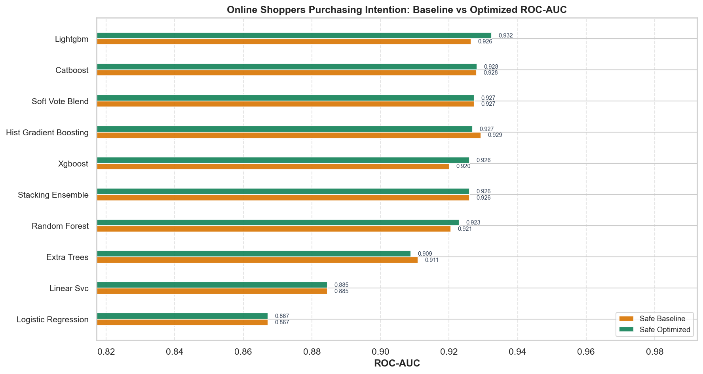
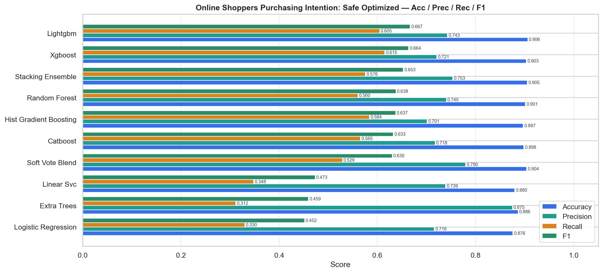
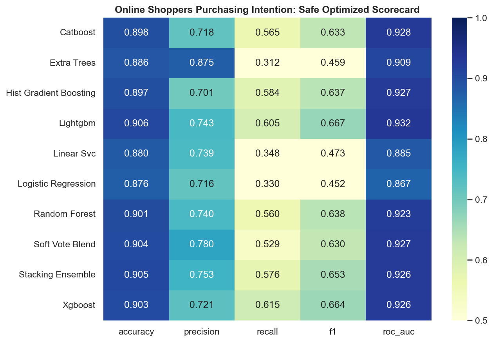
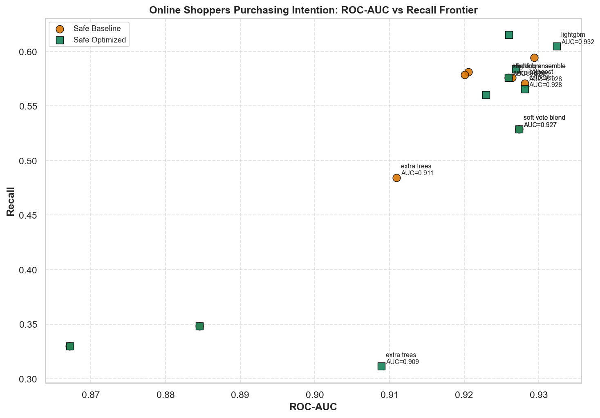
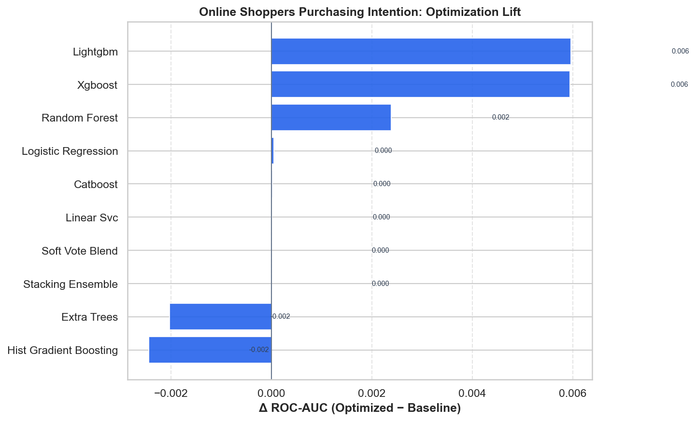

# Online Shoppers Purchasing Intention — Master Benchmark Report

HyperAck-style project folder: `external_projects/online_shoppers_exp/`

- **Source:** [https://archive.ics.uci.edu/dataset/468/online+shoppers+purchasing+intention+dataset](https://archive.ics.uci.edu/dataset/468/online+shoppers+purchasing+intention+dataset)
- **Description:** Predict whether a session ends in a purchase (e-commerce intent).
- **Split:** stratified 80/20, seed 42
- **Champion (safe optimized):** `lightgbm` — ROC-AUC **0.9324**, F1 **0.6667**
- **Overall best:** `lightgbm` (safe/optimized) — ROC-AUC **0.9324**

## Full results

| Mode | Opt | Model | ROC-AUC | Acc | Prec | Rec | F1 |
|---|---|---|---:|---:|---:|---:|---:|
| safe | baseline | hist_gradient_boosting | 0.9294 | 0.9015 | 0.7206 | 0.5942 | 0.6514 |
| safe | baseline | catboost | 0.9281 | 0.8958 | 0.7010 | 0.5707 | 0.6291 |
| safe | baseline | soft_vote_blend | 0.9274 | 0.9039 | 0.7799 | 0.5288 | 0.6303 |
| safe | baseline | lightgbm | 0.9264 | 0.8966 | 0.7029 | 0.5759 | 0.6331 |
| safe | baseline | stacking_ensemble | 0.9259 | 0.9051 | 0.7534 | 0.5759 | 0.6528 |
| safe | baseline | random_forest | 0.9205 | 0.9035 | 0.7400 | 0.5812 | 0.6510 |
| safe | baseline | xgboost | 0.9201 | 0.8933 | 0.6842 | 0.5785 | 0.6270 |
| safe | baseline | extra_trees | 0.9109 | 0.8933 | 0.7371 | 0.4843 | 0.5845 |
| safe | baseline | linear_svc | 0.8845 | 0.8800 | 0.7389 | 0.3482 | 0.4733 |
| safe | baseline | logistic_regression | 0.8672 | 0.8759 | 0.7159 | 0.3298 | 0.4516 |
| safe | optimized | lightgbm | 0.9324 | 0.9063 | 0.7428 | 0.6047 | 0.6667 |
| safe | optimized | catboost | 0.9281 | 0.8982 | 0.7176 | 0.5654 | 0.6325 |
| safe | optimized | soft_vote_blend | 0.9274 | 0.9039 | 0.7799 | 0.5288 | 0.6303 |
| safe | optimized | hist_gradient_boosting | 0.9269 | 0.8970 | 0.7013 | 0.5838 | 0.6371 |
| safe | optimized | xgboost | 0.9260 | 0.9035 | 0.7209 | 0.6152 | 0.6638 |
| safe | optimized | stacking_ensemble | 0.9259 | 0.9051 | 0.7534 | 0.5759 | 0.6528 |
| safe | optimized | random_forest | 0.9229 | 0.9015 | 0.7405 | 0.5602 | 0.6379 |
| safe | optimized | extra_trees | 0.9089 | 0.8865 | 0.8750 | 0.3115 | 0.4595 |
| safe | optimized | linear_svc | 0.8845 | 0.8800 | 0.7389 | 0.3482 | 0.4733 |
| safe | optimized | logistic_regression | 0.8672 | 0.8759 | 0.7159 | 0.3298 | 0.4516 |

## Figures











## Reproduce

```bash
.venv/bin/python external_projects/online_shoppers_exp/run_all.py
```
