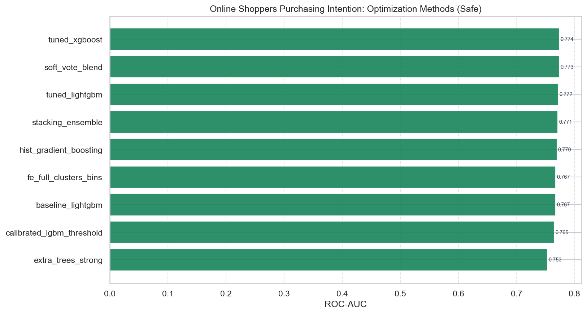
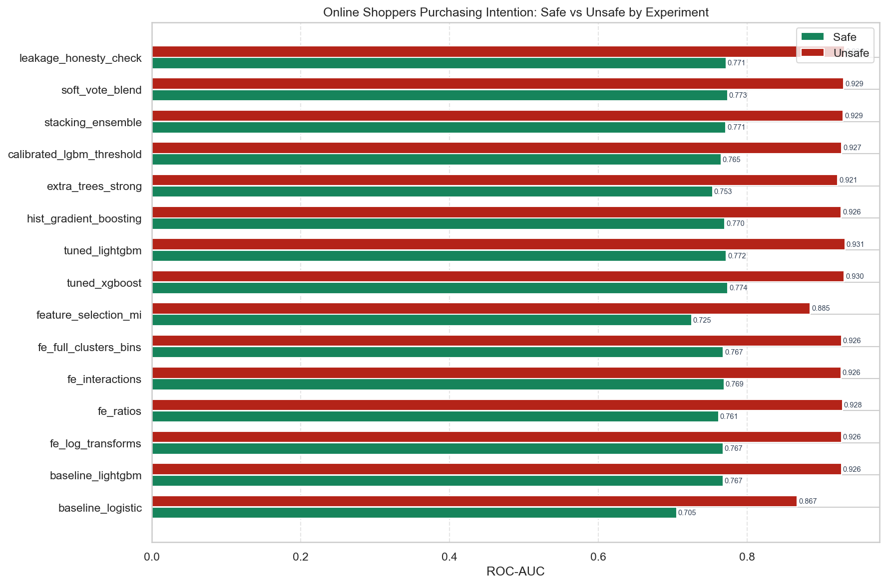
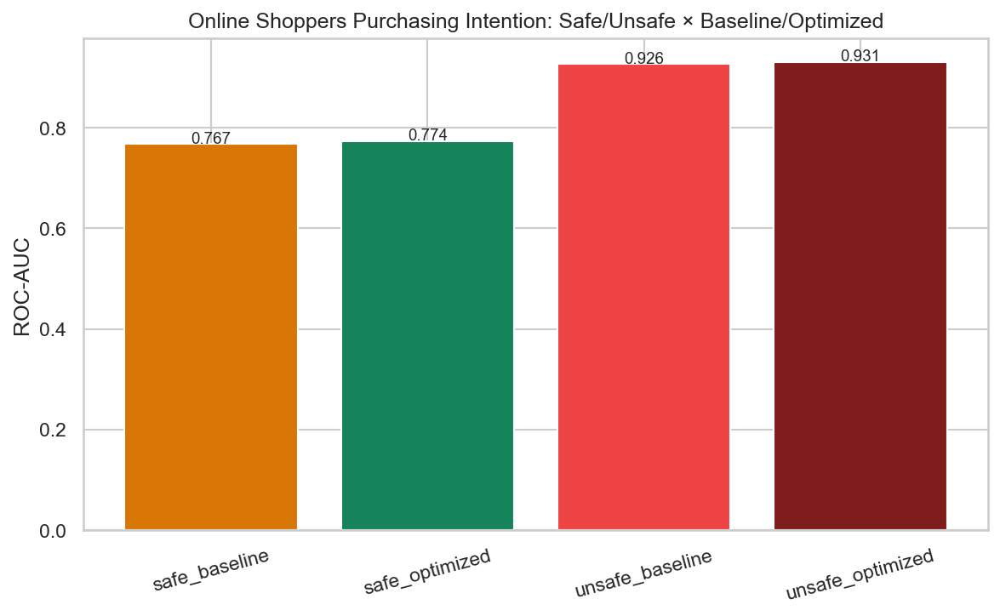

# Online Shoppers Purchasing Intention — Optimization Methods Report

**Question:** Which optimization methods lift ROC-AUC the most on this dataset?

---

## 1. Methods tested

| Method | Experiment | Description |
|---|---|---|
| none (baseline) | 02 baseline_lightgbm | Default LightGBM on raw features |
| FE only | 03–06 | Feature engineering without hyperparameter search |
| mutual_info_selection | 07 | Compact MI feature subset |
| RandomizedSearchCV | 08 tuned_xgboost, 09 tuned_lightgbm | 3-fold CV maximizing ROC-AUC |
| hand_tuned | 11 extra_trees_strong | Playbook ExtraTrees region |
| isotonic_calibration | 12 calibrated_lgbm | Probability calibration |
| oof_stacking | 13 stacking_ensemble | ET+LGBM+XGB → logistic meta |
| soft_probability_blend | 14 soft_vote_blend | Weighted probability average |

---

## 2. Safe-mode ranking (best → worst)

| Rank | Experiment | Method | ROC-AUC | F1 | Notes |
|---:|---|---|---:|---:|---|
| 1 | tuned_xgboost | RandomizedSearchCV_roc_auc | 0.7737 | 0.1212 | RandomizedSearchCV on XGBoost over full FE (HyperAck exp 08). |
| 2 | soft_vote_blend | soft_probability_blend | 0.7735 | 0.0903 | Soft-vote blend ET+LGBM+XGB (HyperAck exp 15 / optimized safe champion style). |
| 3 | tuned_lightgbm | RandomizedSearchCV_roc_auc | 0.7719 | 0.1209 | RandomizedSearchCV on LightGBM over full FE (HyperAck exp 09). |
| 4 | leakage_honesty_check | none | 0.7714 | 0.1718 | Honesty marker: LightGBM on full FE under this mode. Compare safe vs unsafe of t |
| 5 | stacking_ensemble | oof_stacking | 0.7712 | 0.2118 | ET+LGBM+XGB stacked with logistic meta-learner (HyperAck exp 13). |
| 6 | hist_gradient_boosting | none | 0.7696 | 0.2008 | Sklearn HistGB on full FE (HyperAck exp 10). |
| 7 | fe_interactions | none | 0.7687 | 0.1942 | Multiplicative interactions among top-MI features. |
| 8 | fe_full_clusters_bins | none | 0.7675 | 0.1807 | Full FE: logs+ratios+interactions+KMeans clusters+quantile bins (train-fit). |
| 9 | baseline_lightgbm | none | 0.7675 | 0.1962 | Strong GBDT baseline on raw features (HyperAck exp 02). |
| 10 | fe_log_transforms | none | 0.7675 | 0.1962 | Add log1p transforms for skewed non-negative columns. |
| 11 | calibrated_lgbm_threshold | isotonic_calibration | 0.7648 | 0.0103 | Isotonic-calibrated LightGBM; threshold kept at 0.5 for ranking metrics. |
| 12 | fe_ratios | none | 0.7612 | 0.1656 | Add pairwise intensity ratios among high-variance features. |
| 13 | extra_trees_strong | hand_tuned | 0.7532 | 0.0203 | Strong ExtraTrees (n=600, depth=14) on full FE. |
| 14 | feature_selection_mi | mutual_info_selection | 0.7250 | 0.0507 | Keep top-MI subset of full FE matrix (HyperAck exp 07). |
| 15 | baseline_logistic | none | 0.7048 | 0.0104 | Floor: logistic regression on raw features. |

**Winner:** `tuned_xgboost` with method `RandomizedSearchCV_roc_auc`  
**Best pure search method:** `tuned_xgboost` (`RandomizedSearchCV_roc_auc`)

---

## 3. Safe vs Optimized Safe

| Arm | Experiment | ROC-AUC | Recall | F1 |
|---|---|---:|---:|---:|
| Safe baseline | baseline_lightgbm | 0.7675 | — | — |
| Safe optimized (best) | tuned_xgboost | 0.7737 | 0.0681 | 0.1212 |

Lift (best − baseline LGBM): see ranking table and `quadrant_safe_unsafe_opt.png`.

---

## 4. Unsafe vs Optimized Unsafe / Safe vs Unsafe

Leakage columns `['PageValues']` inflate unsafe scores.

| Experiment | Safe AUC | Unsafe AUC | Δ (leakage) | Safe Rec | Unsafe Rec |
|---|---:|---:|---:|---:|---:|
| baseline_lightgbm | 0.7675 | 0.9264 | +0.1590 | 0.1204 | 0.5759 |
| baseline_logistic | 0.7048 | 0.8672 | +0.1623 | 0.0052 | 0.3298 |
| calibrated_lgbm_threshold | 0.7648 | 0.9266 | +0.1618 | 0.0052 | 0.5393 |
| extra_trees_strong | 0.7532 | 0.9213 | +0.1681 | 0.0105 | 0.5445 |
| fe_full_clusters_bins | 0.7675 | 0.9263 | +0.1588 | 0.1126 | 0.5733 |
| fe_interactions | 0.7687 | 0.9257 | +0.1570 | 0.1230 | 0.5759 |
| fe_log_transforms | 0.7675 | 0.9264 | +0.1590 | 0.1204 | 0.5759 |
| fe_ratios | 0.7612 | 0.9278 | +0.1666 | 0.1021 | 0.5864 |
| feature_selection_mi | 0.7250 | 0.8846 | +0.1595 | 0.0288 | 0.5262 |
| hist_gradient_boosting | 0.7696 | 0.9259 | +0.1563 | 0.1257 | 0.5419 |
| leakage_honesty_check | 0.7714 | 0.9304 | +0.1590 | 0.1021 | 0.5864 |
| soft_vote_blend | 0.7735 | 0.9293 | +0.1558 | 0.0497 | 0.5576 |
| stacking_ensemble | 0.7712 | 0.9286 | +0.1573 | 0.1361 | 0.5445 |
| tuned_lightgbm | 0.7719 | 0.9311 | +0.1593 | 0.0681 | 0.5681 |
| tuned_xgboost | 0.7737 | 0.9299 | +0.1563 | 0.0681 | 0.5864 |

**Best unsafe:** `tuned_lightgbm` AUC **0.9311**  
**Leakage cost (best unsafe − best safe):** +0.1575

---

## 5. Recommendation for production

1. Prefer **safe** features only when leakage columns exist.
2. Start from **full FE** then test MI selection.
3. Apply **RandomizedSearchCV** on LightGBM/XGBoost before stacking.
4. Use **soft-vote / stacking** only if they beat the best single tuned model on the locked test set.
