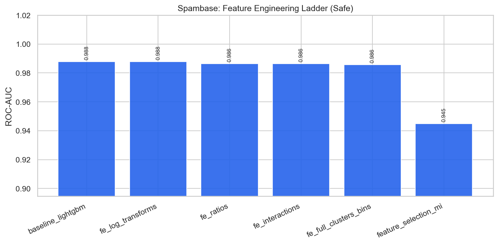

# Spambase — Feature Engineering & Selection Report

**Project:** `external_projects/spambase_exp/`  
**Source:** [https://archive.ics.uci.edu/dataset/94/spambase](https://archive.ics.uci.edu/dataset/94/spambase)  
**Rows / features (raw):** 4601 / 57  
**Positive rate:** 0.394  
**Protocol:** stratified 80/20, seed 42; all stateful FE fit on **train only**

---

## 1. Problem & decision-time policy

Detect spam email from word/character frequency features.

### Leakage / safe vs unsafe
- **Has classic leakage columns:** False
- **Unsafe-only features:** `[]`
- **Rationale:** Word/char frequencies are available at classification time; no leakage identified.

When leakage exists, **safe** drops post-outcome columns (HyperAck analog of final fares).  
When it does not, safe and unsafe matrices are identical — the ladder still documents FE and optimization lifts.

---

## 2. Feature engineering ladder (what we tried)

| Stage | Idea | Why (HyperAck playbook) |
|---|---|---|
| raw | Original numeric matrix | Floor score |
| logs | `log1p` on skewed non-negative cols | Tame heavy tails |
| ratios | Pairwise intensity ratios | Scale-normalized signals |
| interactions | Products of top-MI features | Non-linear combinations |
| full_fe | + KMeans clusters + quantile bins | Spatial/soft thresholds (train-fit) |
| selected | Top mutual-information subset | Test dilution vs compact set |

---

## 3. Safe-mode experiment results

| ID | Experiment | FE stage | #Feats | ROC-AUC | Recall | F1 | Optimization |
|---|---|---|---:|---:|---:|---:|---|
| 01 | baseline_logistic | raw | 57 | 0.9702 | 0.8981 | 0.9093 | none |
| 02 | baseline_lightgbm | raw | 57 | 0.9878 | 0.9311 | 0.9350 | none |
| 03 | fe_log_transforms | logs | 114 | 0.9878 | 0.9311 | 0.9350 | none |
| 04 | fe_ratios | ratios | 129 | 0.9863 | 0.9284 | 0.9284 | none |
| 05 | fe_interactions | interactions | 137 | 0.9865 | 0.9311 | 0.9350 | none |
| 06 | fe_full_clusters_bins | full_fe | 142 | 0.9857 | 0.9229 | 0.9293 | none |
| 07 | feature_selection_mi | selected | 25 | 0.9448 | 0.8375 | 0.8773 | mutual_info_selection |
| 08 | tuned_xgboost | full_fe | 142 | 0.9866 | 0.9284 | 0.9335 | RandomizedSearchCV_roc_auc |
| 09 | tuned_lightgbm | full_fe | 142 | 0.9856 | 0.9394 | 0.9381 | RandomizedSearchCV_roc_auc |
| 10 | hist_gradient_boosting | full_fe | 142 | 0.9857 | 0.9339 | 0.9326 | none |
| 11 | extra_trees_strong | full_fe | 142 | 0.9779 | 0.8733 | 0.9135 | hand_tuned |
| 12 | calibrated_lgbm_threshold | full_fe | 142 | 0.9853 | 0.9394 | 0.9368 | isotonic_calibration |
| 13 | stacking_ensemble | full_fe | 142 | 0.9869 | 0.9311 | 0.9376 | oof_stacking |
| 14 | soft_vote_blend | full_fe | 142 | 0.9859 | 0.9201 | 0.9369 | soft_probability_blend |
| 15 | leakage_honesty_check | full_fe | 142 | 0.9877 | 0.9311 | 0.9350 | none |

**Best safe model:** `baseline_lightgbm` — ROC-AUC **0.9878**, F1 **0.9350**  
**Best optimization method (safe):** `oof_stacking` via `stacking_ensemble` (AUC 0.9869)

### FE stage chart

---

## 4. Feature selection findings

Experiment `07 feature_selection_mi` keeps a top-MI subset of the full FE matrix.  
Compare its ROC-AUC against `06 fe_full_clusters_bins`:

- Full FE AUC: **0.9857** (142 feats)
- Selected AUC: **0.9448** (25 feats)
- Δ: **-0.0409** — full FE retained more signal (dilution not an issue / selection too aggressive).

---

## 5. Figures
- `benchmark_outputs/fe_ladder_safe.png`
- `benchmark_outputs/safe_vs_unsafe_by_experiment.png`
- `benchmark_outputs/ladder_results.csv`
