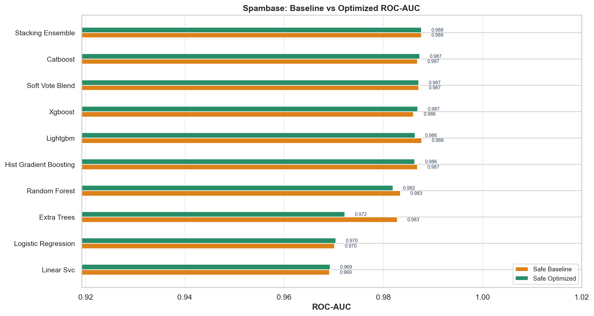
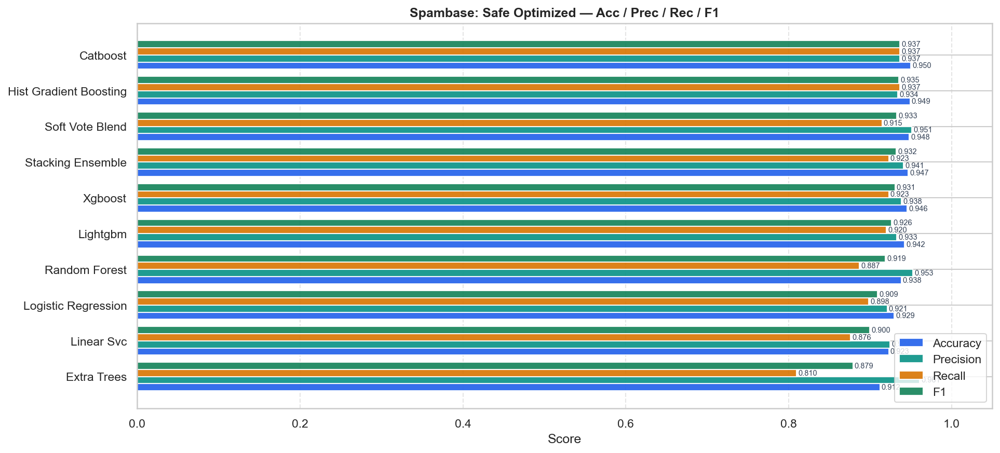
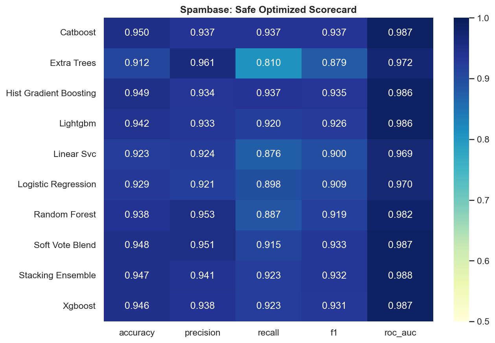
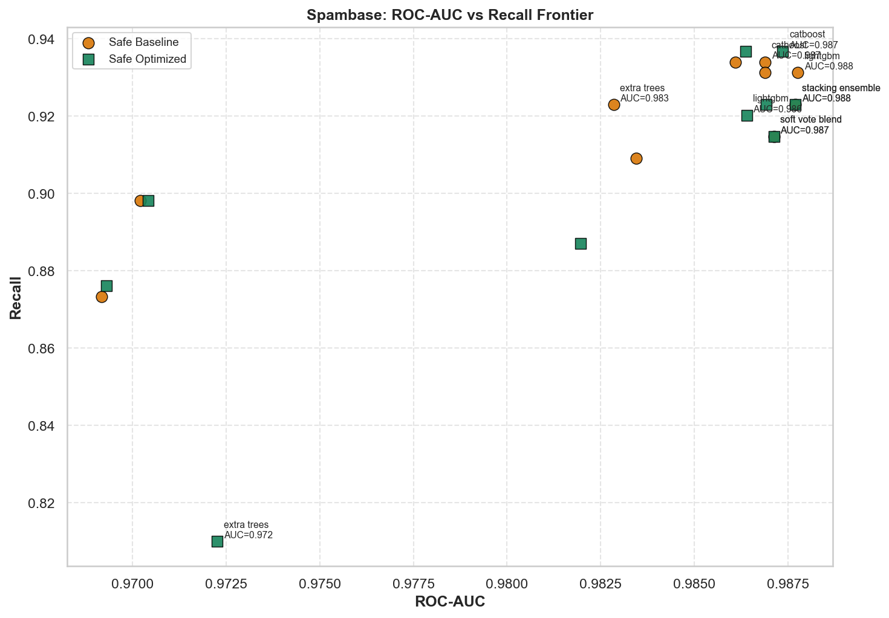
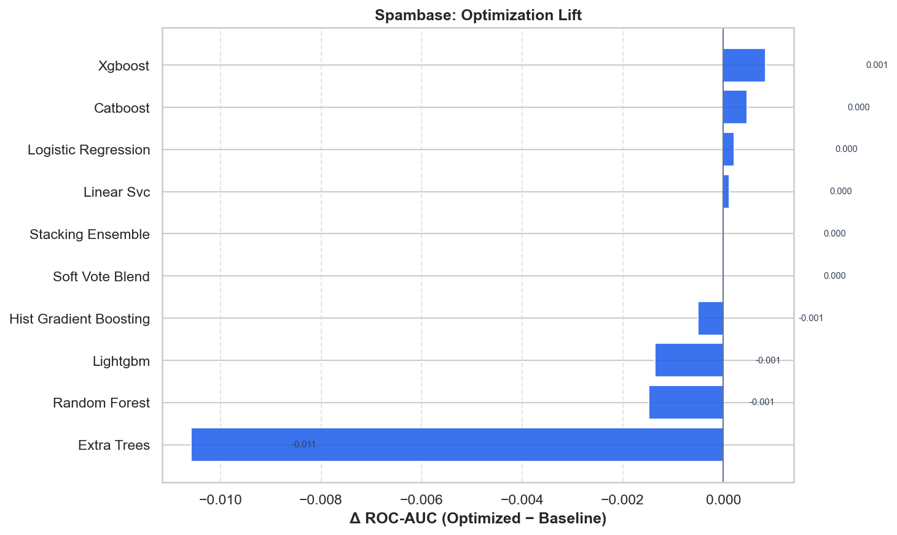

# Spambase — Master Benchmark Report

HyperAck-style project folder: `external_projects/spambase_exp/`

- **Source:** [https://archive.ics.uci.edu/dataset/94/spambase](https://archive.ics.uci.edu/dataset/94/spambase)
- **Description:** Detect spam email from word/character frequency features.
- **Split:** stratified 80/20, seed 42
- **Champion (safe optimized):** `stacking_ensemble` — ROC-AUC **0.9877**, F1 **0.9318**
- **Overall best:** `lightgbm` (safe/baseline) — ROC-AUC **0.9878**

## Full results

| Mode | Opt | Model | ROC-AUC | Acc | Prec | Rec | F1 |
|---|---|---|---:|---:|---:|---:|---:|
| safe | baseline | lightgbm | 0.9878 | 0.9490 | 0.9389 | 0.9311 | 0.9350 |
| safe | baseline | stacking_ensemble | 0.9877 | 0.9468 | 0.9410 | 0.9229 | 0.9318 |
| safe | baseline | soft_vote_blend | 0.9871 | 0.9479 | 0.9513 | 0.9146 | 0.9326 |
| safe | baseline | catboost | 0.9869 | 0.9511 | 0.9417 | 0.9339 | 0.9378 |
| safe | baseline | hist_gradient_boosting | 0.9869 | 0.9468 | 0.9337 | 0.9311 | 0.9324 |
| safe | baseline | xgboost | 0.9861 | 0.9490 | 0.9365 | 0.9339 | 0.9352 |
| safe | baseline | random_forest | 0.9834 | 0.9457 | 0.9510 | 0.9091 | 0.9296 |
| safe | baseline | extra_trees | 0.9828 | 0.9533 | 0.9571 | 0.9229 | 0.9397 |
| safe | baseline | logistic_regression | 0.9702 | 0.9294 | 0.9209 | 0.8981 | 0.9093 |
| safe | baseline | linear_svc | 0.9692 | 0.9207 | 0.9215 | 0.8733 | 0.8967 |
| safe | optimized | stacking_ensemble | 0.9877 | 0.9468 | 0.9410 | 0.9229 | 0.9318 |
| safe | optimized | catboost | 0.9874 | 0.9501 | 0.9366 | 0.9366 | 0.9366 |
| safe | optimized | soft_vote_blend | 0.9871 | 0.9479 | 0.9513 | 0.9146 | 0.9326 |
| safe | optimized | xgboost | 0.9869 | 0.9457 | 0.9384 | 0.9229 | 0.9306 |
| safe | optimized | lightgbm | 0.9864 | 0.9425 | 0.9330 | 0.9201 | 0.9265 |
| safe | optimized | hist_gradient_boosting | 0.9864 | 0.9490 | 0.9341 | 0.9366 | 0.9354 |
| safe | optimized | random_forest | 0.9820 | 0.9381 | 0.9527 | 0.8871 | 0.9187 |
| safe | optimized | extra_trees | 0.9723 | 0.9121 | 0.9608 | 0.8099 | 0.8789 |
| safe | optimized | logistic_regression | 0.9704 | 0.9294 | 0.9209 | 0.8981 | 0.9093 |
| safe | optimized | linear_svc | 0.9693 | 0.9229 | 0.9244 | 0.8760 | 0.8996 |

## Figures











## Reproduce

```bash
.venv/bin/python external_projects/spambase_exp/run_all.py
```
