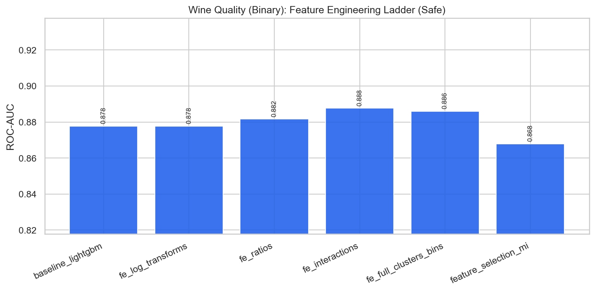

# Wine Quality (Binary) — Feature Engineering & Selection Report

**Project:** `external_projects/wine_quality_exp/`  
**Source:** [https://archive.ics.uci.edu/dataset/186/wine+quality](https://archive.ics.uci.edu/dataset/186/wine+quality)  
**Rows / features (raw):** 6497 / 11  
**Positive rate:** 0.633  
**Protocol:** stratified 80/20, seed 42; all stateful FE fit on **train only**

---

## 1. Problem & decision-time policy

Physicochemical wine tests; quality binarized as high (>=6) vs low.

### Leakage / safe vs unsafe
- **Has classic leakage columns:** False
- **Unsafe-only features:** `[]`
- **Rationale:** Physicochemical tests are available before quality rating; no leakage identified.

When leakage exists, **safe** drops post-outcome columns (HyperAck analog of final fares).  
When it does not, safe and unsafe matrices are identical — the ladder still documents FE and optimization lifts.

---

## 2. Feature engineering ladder (what we tried)

| Stage | Idea | Why (HyperAck playbook) |
|---|---|---|
| raw | Original numeric matrix | Floor score |
| logs | `log1p` on skewed non-negative cols | Tame heavy tails |
| ratios | Pairwise intensity ratios | Scale-normalized signals |
| interactions | Products of top-MI features | Non-linear combinations |
| full_fe | + KMeans clusters + quantile bins | Spatial/soft thresholds (train-fit) |
| selected | Top mutual-information subset | Test dilution vs compact set |

---

## 3. Safe-mode experiment results

| ID | Experiment | FE stage | #Feats | ROC-AUC | Recall | F1 | Optimization |
|---|---|---|---:|---:|---:|---:|---|
| 01 | baseline_logistic | raw | 11 | 0.8045 | 0.8420 | 0.8002 | none |
| 02 | baseline_lightgbm | raw | 11 | 0.8778 | 0.8809 | 0.8555 | none |
| 03 | fe_log_transforms | logs | 17 | 0.8778 | 0.8809 | 0.8555 | none |
| 04 | fe_ratios | ratios | 32 | 0.8816 | 0.8785 | 0.8531 | none |
| 05 | fe_interactions | interactions | 40 | 0.8877 | 0.8797 | 0.8593 | none |
| 06 | fe_full_clusters_bins | full_fe | 45 | 0.8860 | 0.8773 | 0.8590 | none |
| 07 | feature_selection_mi | selected | 25 | 0.8680 | 0.8505 | 0.8393 | mutual_info_selection |
| 08 | tuned_xgboost | full_fe | 45 | 0.8946 | 0.8906 | 0.8711 | RandomizedSearchCV_roc_auc |
| 09 | tuned_lightgbm | full_fe | 45 | 0.8909 | 0.8894 | 0.8652 | RandomizedSearchCV_roc_auc |
| 10 | hist_gradient_boosting | full_fe | 45 | 0.8831 | 0.8785 | 0.8546 | none |
| 11 | extra_trees_strong | full_fe | 45 | 0.8844 | 0.8991 | 0.8580 | hand_tuned |
| 12 | calibrated_lgbm_threshold | full_fe | 45 | 0.8929 | 0.8894 | 0.8663 | isotonic_calibration |
| 13 | stacking_ensemble | full_fe | 45 | 0.8968 | 0.8967 | 0.8729 | oof_stacking |
| 14 | soft_vote_blend | full_fe | 45 | 0.8831 | 0.8858 | 0.8576 | soft_probability_blend |
| 15 | leakage_honesty_check | full_fe | 45 | 0.8695 | 0.8700 | 0.8448 | none |

**Best safe model:** `stacking_ensemble` — ROC-AUC **0.8968**, F1 **0.8729**  
**Best optimization method (safe):** `oof_stacking` via `stacking_ensemble` (AUC 0.8968)

### FE stage chart

---

## 4. Feature selection findings

Experiment `07 feature_selection_mi` keeps a top-MI subset of the full FE matrix.  
Compare its ROC-AUC against `06 fe_full_clusters_bins`:

- Full FE AUC: **0.8860** (45 feats)
- Selected AUC: **0.8680** (25 feats)
- Δ: **-0.0180** — full FE retained more signal (dilution not an issue / selection too aggressive).

---

## 5. Figures
- `benchmark_outputs/fe_ladder_safe.png`
- `benchmark_outputs/safe_vs_unsafe_by_experiment.png`
- `benchmark_outputs/ladder_results.csv`
