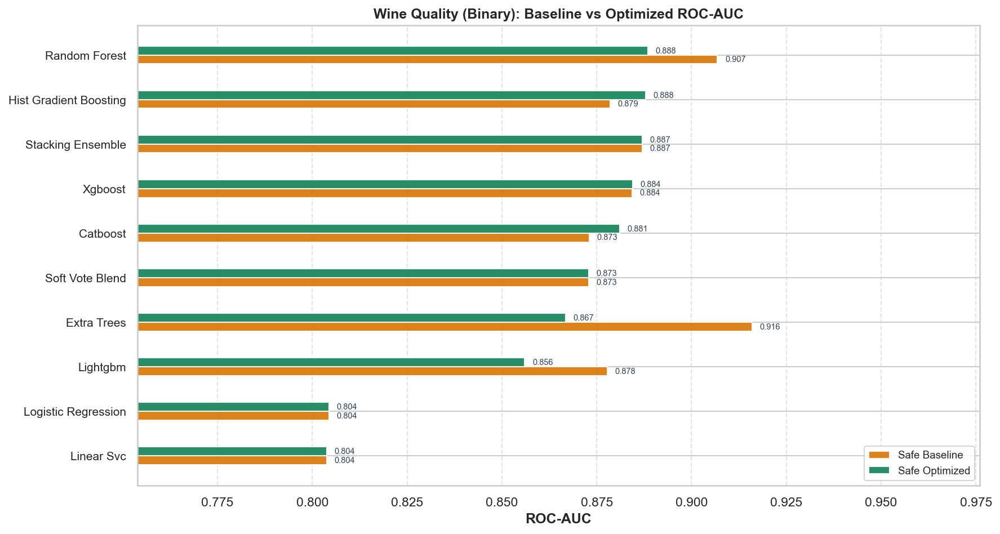
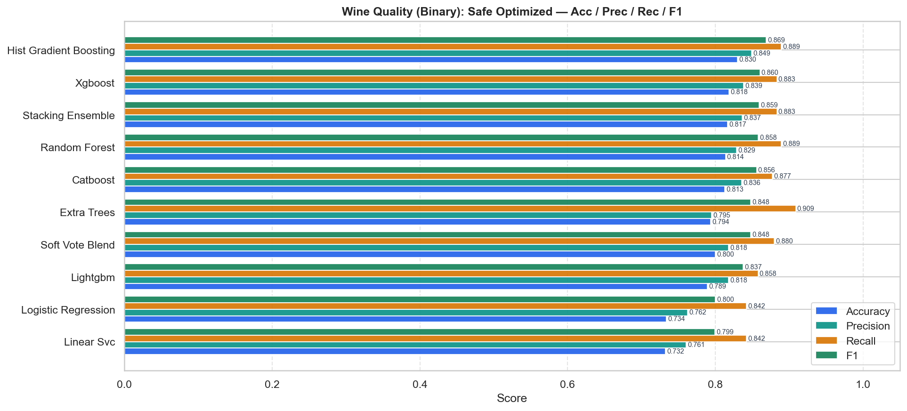
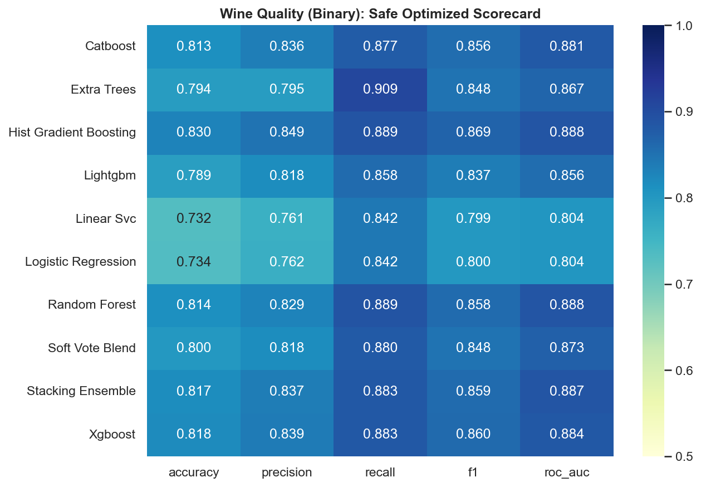
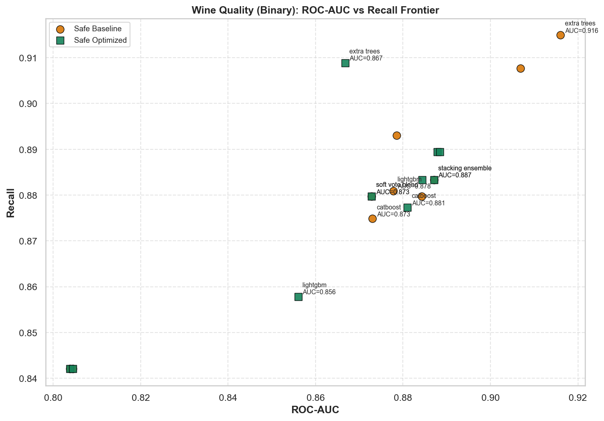
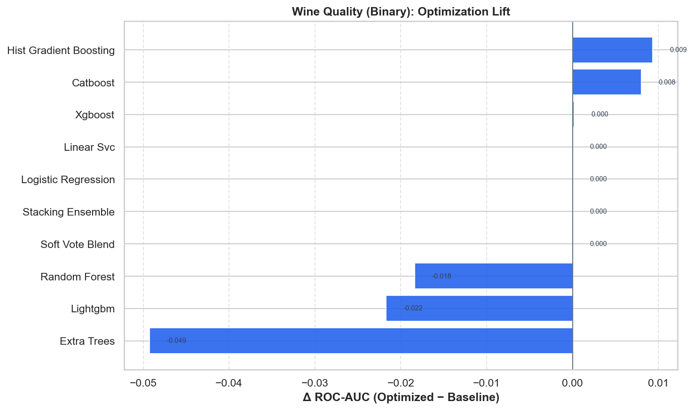

# Wine Quality (Binary) — Master Benchmark Report

HyperAck-style project folder: `external_projects/wine_quality_exp/`

- **Source:** [https://archive.ics.uci.edu/dataset/186/wine+quality](https://archive.ics.uci.edu/dataset/186/wine+quality)
- **Description:** Physicochemical wine tests; quality binarized as high (>=6) vs low.
- **Split:** stratified 80/20, seed 42
- **Champion (safe optimized):** `random_forest` — ROC-AUC **0.8884**, F1 **0.8581**
- **Overall best:** `extra_trees` (safe/baseline) — ROC-AUC **0.9160**

## Full results

| Mode | Opt | Model | ROC-AUC | Acc | Prec | Rec | F1 |
|---|---|---|---:|---:|---:|---:|---:|
| safe | baseline | extra_trees | 0.9160 | 0.8469 | 0.8537 | 0.9149 | 0.8833 |
| safe | baseline | random_forest | 0.9068 | 0.8431 | 0.8537 | 0.9077 | 0.8799 |
| safe | baseline | stacking_ensemble | 0.8871 | 0.8169 | 0.8366 | 0.8834 | 0.8593 |
| safe | baseline | xgboost | 0.8843 | 0.8162 | 0.8380 | 0.8797 | 0.8583 |
| safe | baseline | hist_gradient_boosting | 0.8786 | 0.8215 | 0.8362 | 0.8931 | 0.8637 |
| safe | baseline | lightgbm | 0.8778 | 0.8115 | 0.8314 | 0.8809 | 0.8555 |
| safe | baseline | catboost | 0.8730 | 0.8015 | 0.8229 | 0.8748 | 0.8481 |
| safe | baseline | soft_vote_blend | 0.8728 | 0.8000 | 0.8181 | 0.8797 | 0.8478 |
| safe | baseline | logistic_regression | 0.8045 | 0.7338 | 0.7624 | 0.8420 | 0.8002 |
| safe | baseline | linear_svc | 0.8039 | 0.7323 | 0.7607 | 0.8420 | 0.7993 |
| safe | optimized | random_forest | 0.8884 | 0.8138 | 0.8290 | 0.8894 | 0.8581 |
| safe | optimized | hist_gradient_boosting | 0.8879 | 0.8300 | 0.8492 | 0.8894 | 0.8688 |
| safe | optimized | stacking_ensemble | 0.8871 | 0.8169 | 0.8366 | 0.8834 | 0.8593 |
| safe | optimized | xgboost | 0.8844 | 0.8185 | 0.8385 | 0.8834 | 0.8604 |
| safe | optimized | catboost | 0.8810 | 0.8131 | 0.8356 | 0.8773 | 0.8560 |
| safe | optimized | soft_vote_blend | 0.8728 | 0.8000 | 0.8181 | 0.8797 | 0.8478 |
| safe | optimized | extra_trees | 0.8667 | 0.7938 | 0.7949 | 0.9089 | 0.8481 |
| safe | optimized | lightgbm | 0.8560 | 0.7892 | 0.8181 | 0.8578 | 0.8375 |
| safe | optimized | logistic_regression | 0.8045 | 0.7338 | 0.7624 | 0.8420 | 0.8002 |
| safe | optimized | linear_svc | 0.8039 | 0.7323 | 0.7607 | 0.8420 | 0.7993 |

## Figures











## Reproduce

```bash
.venv/bin/python external_projects/wine_quality_exp/run_all.py
```
