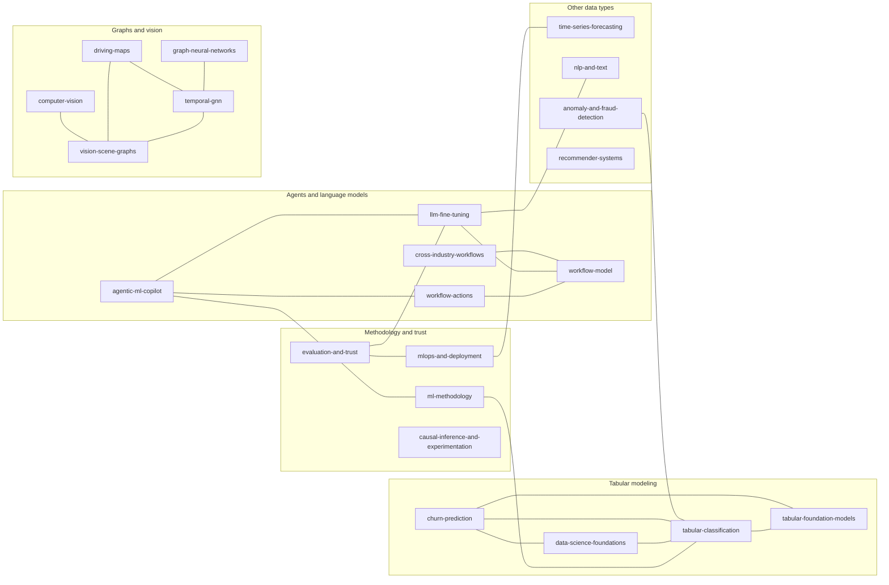

# Research tracks

Each research idea has its own folder, and every folder has the same shape:

```
research/<idea>/
├── README.md       the idea: question, prediction contract, status, conclusions   (written by people)
├── INDEX.md        champion(s), experiments, notebooks, evaluation, reports, related evidence   (generated)
├── experiments/    experiment code and its results/
├── notebooks/      standalone notebooks
├── evaluation/     evaluation outputs: benchmarks, plots, frozen test cases
└── reports/        written reports and research notes
```

Open a track's **INDEX.md** to see everything about the idea at once, including its current champion. `make research-index` regenerates every INDEX after files or results change, and CI fails if one is stale. Folders appear only when a track has content for them.

## How the tracks relate

<!-- track-graph:start -->

<!-- track-graph:end -->

## Active

| Track | Question | Headline so far |
|---|---|---|
| [tabular-classification](tabular-classification/INDEX.md) | Most accurate *honest* classifier for tabular business data (HyperAck + 10 public datasets) | Safe champion ROC-AUC 0.9455; leakage was the largest effect |
| [churn-prediction](churn-prediction/INDEX.md) | Reliable churn ranking; do deep tabular models help? | Logistic regression 0.850 matched or beat boosting and transformers |
| [tabular-foundation-models](tabular-foundation-models/INDEX.md) | Can TabPFN beat tuned boosting without tuning? | Best on Telco churn (0.850); HyperAck rerun needed without leaky fares |
| [llm-fine-tuning](llm-fine-tuning/INDEX.md) | Can a small fine-tuned model reason like a large one with retrieval? | 326 evidence-grounded examples, trainer and evaluator ready |
| [ml-methodology](ml-methodology/INDEX.md) | Which workflow steps change the truth of a result? | 70 campaign experiments, 6 measured pitfalls |
| [agentic-ml-copilot](agentic-ml-copilot/INDEX.md) | Can an agent review and run ML work, with proof? | Copilot, agent tools, critic gate and verification built |

## Planned

| Track | Question |
|---|---|
| [data-science-foundations](data-science-foundations/INDEX.md) | Which EDA and data-cleaning habits prevent later modeling errors? |
| [graph-neural-networks](graph-neural-networks/INDEX.md) | When do GNNs beat tabular models with graph features, without graph leakage? |
| [time-series-forecasting](time-series-forecasting/INDEX.md) | Which forecasters win under honest forward-in-time validation? (seed result from the expansion campaign) |
| [nlp-and-text](nlp-and-text/INDEX.md) | When does text add signal, and how far do simple models get? (seed result) |
| [anomaly-and-fraud-detection](anomaly-and-fraud-detection/INDEX.md) | Methods, metrics and thresholds for rare events (seed result) |
| [recommender-systems](recommender-systems/INDEX.md) | Recommendation under time-ordered evaluation |
| [causal-inference-and-experimentation](causal-inference-and-experimentation/INDEX.md) | From "what will happen" to "what happens if we act" |
| [computer-vision](computer-vision/INDEX.md) | Accuracy per unit of compute on business image tasks |
| [mlops-and-deployment](mlops-and-deployment/INDEX.md) | Keeping a validated model valid in production |
| [evaluation-and-trust](evaluation-and-trust/INDEX.md) | What measurable evidence shows the assistant is correct, useful and safe within a defined scope? (automated checks and the blind auditor replay exist) |
| [workflow-model](workflow-model/INDEX.md) | Can a small model reliably follow a narrow, versioned workflow and choose the next valid step? |
| [workflow-actions](workflow-actions/INDEX.md) | Can the model generate a complete, validated action or code block with fewer fragile steps? |
| [vision-scene-graphs](vision-scene-graphs/INDEX.md) | Can visual objects and their relationships be represented and grounded with evidence? |
| [temporal-gnn](temporal-gnn/INDEX.md) | Does graph reasoning over objects and time beat simpler baselines on interactions and events? |
| [driving-maps](driving-maps/INDEX.md) | Can actor, lane and map graphs support evidence-grounded predictions in one bounded driving scenario? (safety-critical) |
| [cross-industry-workflows](cross-industry-workflows/INDEX.md) | Which parts of DCLab's workflow engine transfer to other industries? |

Related planned tracks: [graph-neural-networks](graph-neural-networks/) covers GNNs on tabular and relational business data; [temporal-gnn](temporal-gnn/) covers graphs of objects in video. [computer-vision](computer-vision/) covers image tasks in general; [vision-scene-graphs](vision-scene-graphs/) covers object relationships.

## Read the status accurately

- **Active / existing evidence:** code, experiment artifacts or a report already exist. Read their limits; this does not mean the idea is validated for every use.
- **Implemented, limited scope:** a working prototype with stated boundaries.
- **Planned / proposed:** the idea is defined and needs a prototype and evaluation. A charter is not an implementation or a positive result.

The computer-vision, scene-graph, GNN, graph-transformer, autonomous-driving and cross-industry tracks are proposed research. The strongest existing work is tabular classification, the evidence campaigns, the notebook copilot and the agentic Research Studio.

## Recommended order

1. Strengthen the tabular workflow and the notebook assistant, where data and prototypes already exist.
2. Evaluate evidence retrieval, recommendations and user-visible claims (evaluation-and-trust).
3. Evaluate workflow-following models on held-out tasks before investing in fine-tuning.
4. Prototype scene graphs on short, labeled videos, and compare against video-only and pairwise baselines before adding a GNN or graph transformer.
5. Study driving and other industries only after the domain data, scenario coverage and safety evaluation are available.

## Add a new idea

```bash
make new-track NAME=my-new-idea TITLE="My new idea" PREFIX=MNI
```

This creates `research/my-new-idea/` from [`_template/`](_template/README.md), with a README (question, prediction contract, experiment log, result schema) and the standard `experiments/`, `notebooks/`, `evaluation/` and `reports/` folders. If the track already has a planned README, its notes are kept. Then add the track to the tables above.

## Conventions

- **Keep proposals separate from measured outcomes.** Record the question, data source and license, split strategy, method, code and data fingerprints, metrics, failures, uncertainty, counterevidence and the next question. Never label a result production-ready on benchmark performance alone.

- **What stays outside `research/`:** data in `data/` and `data/public/`, cross-track evidence campaigns in `evidence/campaigns/`, generated knowledge in `evidence/knowledge/`, and shared code in `dclab_rnd/` and `general_pipeline/`.
- **One result file per experiment.** Write it in the schema in the template, so the evidence index, critic gate and SFT builder can learn from it. Run `make knowledge` and `make research-index` after adding results.
- **Prediction contract first.** No score is recorded before the prediction moment and the forbidden columns are written down.
- **Review your notebooks** with `python -m dclab_rnd.copilot review NOTEBOOK.ipynb` before sharing results.
